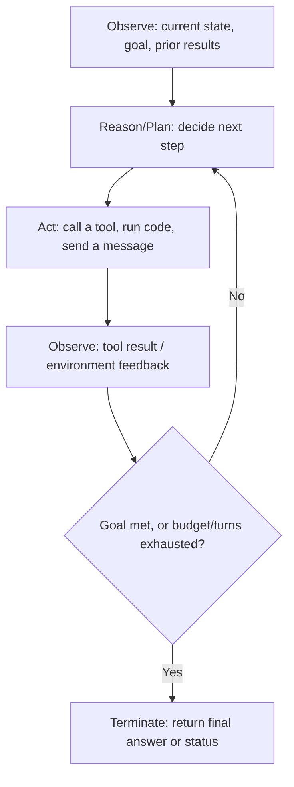

# Agentic AI Fundamentals

Read [Preliminary AI Concepts](../ai-security/ai-preliminary-concepts.md) first if tokens, context windows, and system/user/assistant roles aren't already familiar - this page builds directly on them.

## What Actually Makes Something "Agentic"

A chatbot takes one input and produces one output: you ask, it answers, the interaction ends. Wiring a single function call onto an LLM doesn't make it agentic either - a model that looks up the weather once and reports back is still just a one-shot tool-augmented chatbot. What makes a system **agentic** is the *loop*: the model's output at one step becomes part of the input at the next step, repeatedly, so the system can plan, act, observe the result, and adjust - working toward a goal across multiple steps with reduced human input at each one, rather than returning a single best-effort answer.

This distinction matters immediately for security: a chatbot's worst failure mode is a bad sentence. An agent's worst failure mode is a bad *action* - and the more steps it takes autonomously before a human looks at what it's doing, the larger the blast radius of a single bad decision. See [Agentic AI & Agent Security](../ai-security/agentic-ai-security.md) for the full risk treatment; this page only covers the architecture.

## The Core Agent Loop

Every agentic system, regardless of framework, is some variation of the same loop:



The critical detail most people miss: **the model never executes anything itself.** At every "Act" step, the model only emits text - typically a structured call naming a function and arguments, e.g. `{"tool": "send_email", "args": {"to": "...", "body": "..."}}`. Some separate piece of code (the harness - see [Harness and Loop Engineering](harness-and-loop-engineering.md)) parses that text, decides whether to actually run it, executes it, and feeds the real-world result back into the model's context as the next "Observe." This is precisely why harness design, not model capability, is the real control point for most agentic risk - the model can *propose* deleting a database, but something else always has to *decide* to let that happen.

## Agent Design Patterns

Three patterns show up repeatedly across frameworks and papers, each trading off planning upfront vs. adapting as you go:

| Pattern | How It Works | Tradeoff |
|---------|----------------|-----------|
| **ReAct** (Reason + Act) | Interleaves a visible chain-of-thought reasoning step with each tool call: *Thought → Action → Observation*, repeated. The model re-plans after every single observation. | Adapts well to surprises (a tool fails, a search returns nothing useful) since it re-plans constantly, but can be slow/expensive for long tasks since every step re-reasons from scratch. |
| **Plan-and-Execute** | The model decomposes the entire task into a multi-step plan up front, then executes the steps (sometimes re-planning only if a step fails), rather than reasoning fresh at every single action. | Cheaper and more predictable for well-understood tasks, but brittle if the initial plan was wrong and the system doesn't re-plan aggressively enough. |
| **Reflection / Self-Critique** | The agent generates an output, then critiques its own work against the original goal before finalizing - sometimes looping back to retry if the critique finds a flaw. | Catches a class of errors a single forward pass misses, at the cost of extra inference calls per task. |

ReAct is the foundational pattern here - introduced by Yao et al. in "ReAct: Synergizing Reasoning and Acting in Language Models" (arXiv:2210.03629, Oct 2022), it demonstrated that interleaving reasoning traces with actions reduced hallucination and error propagation compared to reasoning or acting alone, using question-answering and fact-verification tasks against a live Wikipedia API as the testbed. Most production agent frameworks today are a variation or hybrid of these three patterns rather than a pure implementation of any one.

## Tool Use / Function Calling, Mechanically

```python
# 1. The harness tells the model what tools exist (name, description, parameter schema)
tools = [{
    "name": "search_tickets",
    "description": "Search the support ticket database by customer email.",
    "parameters": {"type": "object", "properties": {"email": {"type": "string"}}}
}]

# 2. The model, given a user request, emits a structured call - it does NOT run anything
model_output = {"tool": "search_tickets", "args": {"email": "user@example.com"}}

# 3. The harness - ordinary application code, outside the model entirely - decides
#    whether to execute it, then actually runs it
if is_authorized(model_output["tool"]):
    result = search_tickets(**model_output["args"])

# 4. The result is fed back into the model's context as the next turn
messages.append({"role": "tool", "name": "search_tickets", "content": str(result)})
```

Notice the tool's `description` field is fed into the model's context exactly like any other text it reads - which is the mechanism behind **tool poisoning**, covered in [MCP Security](../ai-security/mcp-security.md). The architectural fact worth internalizing here is simpler: a tool definition is just more context the model attends to, with no special trust elevation over any other text in the window.

## Agent Memory

Agents need to retain information across more than one inference call, and there are two architecturally distinct ways this happens:

- **Short-term / working memory** - just the conversation history sitting in the current context window (prior turns, tool results, scratchpad notes). It disappears the moment the session ends unless something explicitly persists it, and it's bounded by the model's context window size.
- **Long-term / persistent memory** - information written to external storage (a vector database for semantic retrieval, a structured database for exact facts) that survives across sessions and gets explicitly retrieved back into context when relevant. This is what lets an agent "remember" a user's preference from last week or an org's "approved vendor" list.

Both are just data the model reads back into its context window at some later point - there's no architectural distinction between "a fact the agent correctly recorded" and "a fact an attacker successfully planted," which is exactly the mechanism behind memory poisoning (see [Agentic AI Security](../ai-security/agentic-ai-security.md)'s ASI06 coverage for the attack side of this).

## Security Angle

This page covers the mechanism; [Agentic AI & Agent Security](../ai-security/agentic-ai-security.md) covers what goes wrong with it - the OWASP Top 10 for Agentic Applications (ASI01-ASI10), excessive agency, zero trust for agents, and real incidents. Read that page next if you haven't already.

## Credits/References

1. Yao et al., ["ReAct: Synergizing Reasoning and Acting in Language Models"](https://arxiv.org/abs/2210.03629) (arXiv:2210.03629, ICLR 2023)
2. [OWASP GenAI Security Project](https://genai.owasp.org/)
3. [Model Context Protocol specification](https://modelcontextprotocol.io/) - the current standard for the tool-definition/tool-call mechanics described above
