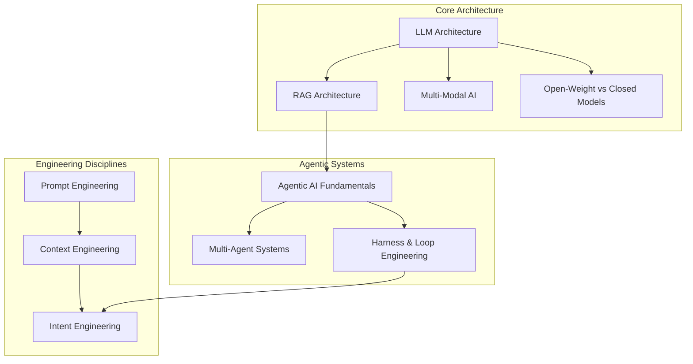

# AI Fundamentals Overview

Before you can reason about why an AI system is vulnerable, you need to know how it actually works. You can't meaningfully evaluate prompt injection without understanding that there's no architectural separation between instructions and data in a context window. You can't evaluate excessive agency without understanding what a harness/loop actually controls versus what the model itself decides. You can't evaluate RAG poisoning without understanding how retrieval and chunking actually work. This section is that layer - the architecture and engineering disciplines underneath [AI Security](../ai-security/ai-security-overview.md), built to be read first if you're new, or skipped straight past if you already know this material.

## Why Fundamentals Before Security

- **Security findings are architecture-specific.** "Vector and Embedding Weaknesses" (OWASP LLM09) only makes sense once you know what an embedding is and how a vector store does similarity search.
- **Agentic risk is a function of harness design, not just model behavior.** ASI02 Tool Misuse and ASI08 Cascading Failures are consequences of how a harness wires tool calls into a loop - you have to understand the loop to understand the failure mode.
- **Engineering terminology keeps shifting, and so does the attack surface.** Prompt engineering, context engineering, and intent engineering are successive, broader framings of the same underlying problem - each one expands what's "in scope" for both the engineer and the attacker.

## The Learning Path

## Section Contents

| Area | Page | Focus |
|------|------|-------|
| Core Architecture | [LLM Architecture](llm-architecture.md) | Transformers, attention, context windows, inference mechanics - the engine everything else sits on |
| Core Architecture | [RAG Architecture](rag-architecture.md) | Retrieval, chunking, embeddings, vector stores, hybrid search |
| Core Architecture | [Multi-Modal AI](multi-modal-ai.md) | Vision/audio/video-capable models, cross-modal fusion |
| Core Architecture | [Open-Weight vs. Closed Models](open-weight-vs-closed-models.md) | Llama/Mistral/DeepSeek vs. GPT/Claude/Gemini - licensing, deployment, and security tradeoffs |
| Agentic Systems | [Agentic AI Fundamentals](agentic-ai-fundamentals.md) | Planning loops, tool use, ReAct and plan-execute patterns |
| Agentic Systems | [Multi-Agent Systems](multi-agent-systems.md) | Orchestration patterns - supervisor, swarm, pipeline - and inter-agent communication |
| Agentic Systems | [Harness & Loop Engineering](harness-and-loop-engineering.md) | The scaffolding around a model - tool-calling loops, termination conditions, budget/turn limits |
| Engineering Disciplines | [Prompt Engineering](prompt-engineering.md) | Crafting input deliberately for desired model behavior |
| Engineering Disciplines | [Context Engineering](context-engineering.md) | Managing everything in the context window, not just the prompt |
| Engineering Disciplines | [Intent Engineering](intent-engineering.md) | Translating ambiguous human goals into structured agent objectives (emerging term) |
| Reference | [AI Fundamentals Resources](ai-fundamentals-resources.md) | Papers, books, courses, and tools to go deeper on any topic above |

## From Fundamentals to Security

Each fundamentals page ends with a **Security Angle** section pointing to the matching page in [AI Security](../ai-security/ai-security-overview.md) - read fundamentals first if you're new to how these systems work, or jump straight to security if you already know the architecture and just need the attack surface.

## Credits/References

1. [OWASP GenAI Security Project](https://genai.owasp.org/) - the security taxonomy this fundamentals layer feeds into
2. [Anthropic: Effective Context Engineering for AI Agents](https://www.anthropic.com/engineering/effective-context-engineering-for-ai-agents)
3. Vaswani et al., ["Attention Is All You Need"](https://arxiv.org/abs/1706.03762)
