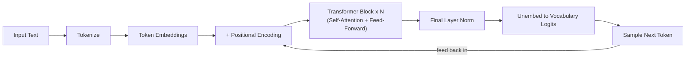

# LLM Architecture

## Decoder-Only Transformers: The Standard Shape

The original Transformer paper ([Vaswani et al., 2017](https://arxiv.org/abs/1706.03762)) described an encoder-decoder architecture built for machine translation - an encoder reads the full input, a decoder generates the output one token at a time while attending back to the encoder's representation. Essentially every modern production LLM (GPT, Claude, Llama, Gemini, Mistral, DeepSeek, Qwen) instead uses a **decoder-only** architecture: there's no separate encoder, just a stack of decoder blocks that both read the prompt and generate the continuation using the same mechanism, one token at a time. This simplification turned out to scale better than the full encoder-decoder design for the general-purpose "predict the next token" objective that makes a model useful for almost any task once it's large enough.

## The Forward Pass, Step by Step

What actually happens between you hitting enter and a response appearing:

1. **Tokenize** - the input text is split into sub-word tokens from a fixed vocabulary (see [Preliminary AI/ML Concepts](../ai-security/ai-preliminary-concepts.md#tokens) for why this matters for security).
2. **Embed** - each token ID is looked up in an embedding table, turning it into a vector of a few thousand numbers.
3. **Positional encoding** - since attention has no inherent sense of word order, a position signal is added/blended into each token's embedding so the model knows token 3 came before token 7. Most current models use **RoPE** (Rotary Position Embedding), which encodes relative position directly into the attention computation rather than adding a separate position vector - this is also what makes context-length extension techniques like **YaRN** possible: you can rescale RoPE's frequency parameters to stretch a model trained on a shorter context into usefully attending over a longer one, without retraining from scratch.
4. **Transformer blocks** - the embeddings pass through dozens of stacked blocks, each doing self-attention (every token looks at every other token to decide what's relevant) followed by a feed-forward network (a per-token non-linear transformation). This repeats N times (N = the model's "layer count").
5. **Unembedding** - the final block's output is projected back into a score ("logit") for every token in the vocabulary - essentially "how likely is each possible next token."
6. **Sampling** - those logits become a probability distribution (via softmax), and the next token is sampled from it - see [Temperature and Sampling](../ai-security/ai-preliminary-concepts.md#temperature-and-sampling) for why this step isn't deterministic.
7. The newly generated token gets appended to the sequence and the whole process repeats to generate the next one - this is why LLM generation is inherently sequential and token-by-token, not a single bulk computation.

## What a Parameter Count Actually Is

When you hear "7B" or "70B" parameters, that's the count of individual numbers (weights) in the model's weight matrices - mostly concentrated in the feed-forward layers and attention projection matrices of each transformer block, plus the (often very large) embedding/unembedding tables. More parameters generally means more capacity to represent complex patterns, at the cost of more compute and memory to run. A "70B" model stored at standard half-precision (2 bytes per parameter) needs roughly 140GB just to hold the weights in memory, before accounting for the activation memory needed during inference - which is why running large models locally is a genuine hardware constraint, and why quantization (storing weights at lower precision, e.g. 4-bit instead of 16-bit) is such a common practical technique to shrink that footprint.

## KV Caching: Why Inference Gets Cheaper Per Token

Naively, generating each new token would require recomputing attention over the entire sequence so far from scratch - wasteful, since most of that computation doesn't change between steps. **KV caching** stores the key (K) and value (V) vectors computed for every previous token, so each new token only needs to compute attention using its own query against the cached K/V pairs, not recompute everything. This is why the *first* token of a response (prompt processing / "time to first token") is comparatively slow, while subsequent tokens stream out faster - and why context length has a direct, multiplicative cost on serving infrastructure: the KV cache itself grows linearly with context length and must be held in GPU memory for the entire duration of a request.

## Mixture of Experts (MoE): Sparse Activation at Scale

As of 2025-2026, Mixture of Experts has become the default architecture for frontier-scale models - nearly every current top-tier model (DeepSeek-V3/R1, Llama 4, Mistral Large 3, the Gemini family, GPT-OSS, Qwen3, Kimi K2) uses some form of it. The idea: replace each block's single dense feed-forward network with many smaller "expert" sub-networks plus a lightweight router that decides, per token, which small subset of experts actually gets used.

| Model | Total Params | Active Params per Token | Experts |
|-------|---------------|----------------------------|---------|
| Mixtral 8x7B | 46.7B | 13B | 8 experts, top-2 routing |
| DeepSeek-V3 | 671B | 37B | 256 experts per layer, top-8 routing |
| Qwen3-235B-A22B | 235B | 22B | 128 experts, fine-grained, no shared expert |
| GPT-OSS-120B | 116.8B | 5.1B | 128 experts, top-4 routing |
| Kimi K2 | ~1.04T | ~32.6B | 384 experts, top-8 routing |

The practical payoff: a model can have an enormous total parameter count (and therefore enormous learned capacity) while only "activating" - and paying the compute cost of - a small fraction of it per token. The tradeoff is operational, not accuracy-related: serving a sparse MoE model efficiently (routing tokens to the right experts, balancing load across them, holding all experts in memory even though only a few fire per token) is considerably harder than serving an equivalent dense model.

## Context Window Mechanics

A model's context window (the maximum tokens it can consider at once) is bounded by two things in combination: the positional encoding scheme's ability to represent position meaningfully at that range, and the serving infrastructure's ability to hold the resulting KV cache in memory. RoPE-based models can often be extended well beyond their original training length using techniques like YaRN, which is why you'll see the same base model released with multiple context-length variants over time (the architecture doesn't fundamentally change; the position-encoding scaling and some further training does).

## Security Angle

Every one of the mechanisms above has a direct downstream security consequence, covered in depth in [LLM Security](../ai-security/llm-security.md) and [AI Security Fundamentals](../ai-security/ai-security-fundamentals.md):

- **KV cache and context-window mechanics** are exactly why **LLM06:2026 Unbounded Consumption** works the way it does - an attacker who can force a model into processing or generating an unusually long sequence is directly driving up memory and compute cost, not just annoying the model.
- **The attention mechanism having no built-in trust hierarchy** between system/user/retrieved-document tokens is the architectural root cause of **LLM01:2026 Prompt Injection** - there is no equivalent of a parameterized query at this layer, by design.
- **Sampling non-determinism** (temperature > 0) is why red-teaming an LLM requires statistical thinking - a single failed jailbreak attempt proves nothing, see [AI Red Teaming](../ai-security/ai-red-teaming.md).
- **MoE's expert-routing layer** is itself an emerging, less-studied attack surface - a model that behaves differently depending on which experts a specific input routes to is harder to exhaustively red-team than a dense model with uniform behavior across all inputs.

## Credits/References

1. Vaswani et al., ["Attention Is All You Need"](https://arxiv.org/abs/1706.03762) - the original Transformer paper
2. Xiao & Zhu, ["Foundations of Large Language Models"](https://arxiv.org/abs/2501.09223)
3. [A Survey on Mixture of Experts in Large Language Models](https://arxiv.org/abs/2407.06204)
4. [GPT-OSS-20B: A Deployment-Centric Analysis of OpenAI's Open-Weight MoE Model](https://arxiv.org/abs/2508.16700)
5. [Sebastian Raschka: Mixture of Experts (LLMs from Scratch)](https://sebastianraschka.com/llms-from-scratch/ch04/07_moe/)

## Practice Next

- [Preliminary AI/ML Concepts](../ai-security/ai-preliminary-concepts.md) for tokens, embeddings, and attention basics if those are new
- [RAG Architecture](rag-architecture.md) for how retrieval extends a model's effective knowledge beyond its training data
- [LLM Security](../ai-security/llm-security.md) for the full OWASP Top 10 built on top of these mechanics
