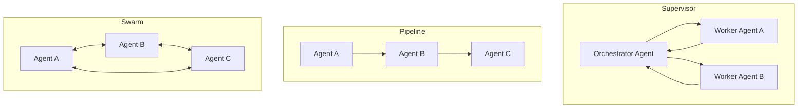

# Multi-Agent Systems

Read [Agentic AI Fundamentals](agentic-ai-fundamentals.md) first - this page assumes you understand the single-agent loop, tool use, and memory before adding the complexity of multiple agents coordinating.

## Why Multiple Agents Instead of One

A single agent with every possible tool and an enormous system prompt covering every scenario tends to perform worse, not better, as scope grows - instructions dilute each other, and the agent has no way to specialize its reasoning for wildly different sub-tasks. Splitting work across multiple agents buys three things a monolithic agent can't:

- **Task decomposition and specialization** - a research agent, a code-writing agent, and a review agent can each carry a focused system prompt and tool set tuned to their one job, rather than one agent juggling all three contexts at once.
- **Parallelism** - independent sub-tasks (reading five different documents, querying three different APIs) can run concurrently across agents instead of serially within one.
- **Separation of concerns and permissions** - this is the security-relevant one: a research agent that only reads public documentation has no business holding the same credentials as a finance agent that can move money. Splitting agents by function lets you scope each agent's tool access to exactly what its job needs, rather than granting one agent the union of every permission any sub-task might ever require.

## Orchestration Topologies

| Topology | How It Works | When It's Used |
|----------|----------------|------------------|
| **Supervisor / Orchestrator** | One coordinating agent breaks the task down, delegates sub-tasks to specialized worker agents, and synthesizes their results into a final answer. | The most common production pattern - a clear control point, easier to audit and reason about than peer-to-peer coordination. |
| **Pipeline / Sequential** | A fixed chain: agent A's output becomes agent B's input becomes agent C's input, in a predetermined order. | Well-defined multi-stage workflows (draft → review → publish) where the sequence itself doesn't need to change at runtime. |
| **Hierarchical** | Nested supervisors - a top-level orchestrator delegates to mid-level supervisors, each of which coordinates its own team of worker agents. | Large, complex workflows where a single flat supervisor would have too many direct reports to coordinate effectively. |
| **Swarm / Peer-to-peer** | Agents communicate directly with each other without a central coordinator, negotiating and adapting the division of labor at runtime. | More flexible and autonomous, but materially harder to govern, audit, and secure - there's no single point where you can observe or gate the whole interaction. |

In practice, 2026-era production systems frequently combine topologies rather than picking one purely - e.g. a top-level supervisor for routing and overall state, with individual worker "teams" internally structured as their own sub-pipelines.

## Real Frameworks Implementing These Patterns

This space moves fast enough that specific framework comparisons age quickly, but the architectural roles are stable:

- **[LangGraph](https://github.com/langchain-ai/langgraph)** - a graph-based orchestration framework (reached a stable 1.0 API in late 2025) that models agent workflows as an explicit state graph, which maps naturally onto audit trails and rollback points - a common choice when production reliability and observability matter more than speed of initial prototyping.
- **[CrewAI](https://github.com/crewAIInc/crewAI)** - a role-based framework (name each agent a role, give it a goal and tools) that prioritizes fast time-to-first-working-prototype; it has since decoupled from LangChain to run standalone.
- **[AutoGen](https://github.com/microsoft/autogen) / AG2** - built around a conversational model where multiple agents participate in a shared "group chat," with a selector logic deciding which agent speaks next at each turn. Microsoft's original AutoGen project has slowed; the community-maintained **AG2** fork continues active development under an open license.

Verify current maturity/adoption before citing specific numbers in anything you publish externally - this list changes every few months.

## Inter-Agent Communication

Agents in a multi-agent system need a way to actually exchange information, and this happens through one of a few mechanisms:

- **Structured messages** - agents pass explicit, schema-defined messages to each other (a request, a result, a status update), analogous to an API call between services.
- **Shared memory / blackboard pattern** - agents don't message each other directly; instead they read and write to a common store that all of them can see, and coordination emerges from what each agent chooses to read or write.
- **A formal agent-to-agent protocol** - **A2A (Agent2Agent Protocol)**, originally published by Google in April 2025, standardizes how independently-built agents (potentially on different frameworks, different vendors) discover each other's capabilities (via a published "Agent Card") and exchange tasks/results. Google donated A2A to the Linux Foundation in mid-2025, and by 2026 it sits alongside MCP under the Linux Foundation's Agentic AI Foundation. The consensus architectural framing as of 2026: **MCP handles what a single agent can access** (tools, data sources), while **A2A handles how separate agents coordinate with each other** - the two are complementary layers, not competitors. See [MCP Security](../ai-security/mcp-security.md) for the tool-access layer.

## Security Angle

Every communication channel between agents - structured messages, shared memory, or a formal protocol like A2A - is an attack surface the moment you add a second agent, because each agent has to decide how much to trust input arriving from another agent's output. [Agentic AI & Agent Security](../ai-security/agentic-ai-security.md) already covers this in depth: **ASI07 (Insecure Inter-Agent Communication)**, the documented **Agent-in-the-Middle (AiTM)** attack research showing a 40-70%+ success rate intercepting and rewriting messages *between* legitimate agents without touching either endpoint, and the **MAESTRO** threat-modeling framework for systematically walking through multi-agent attack surface layer by layer. Read that page for the attack side of everything this page just described mechanically.

## Credits/References

1. [LangGraph](https://github.com/langchain-ai/langgraph)
2. [CrewAI](https://github.com/crewAIInc/crewAI)
3. [AG2 (AutoGen community fork)](https://github.com/ag2ai/ag2)
4. [A2A Protocol specification](https://a2a-protocol.org/) - under the Linux Foundation's Agentic AI Foundation
5. He et al., [Red-Teaming LLM Multi-Agent Systems via Communication Attacks](https://arxiv.org/abs/2502.14847) (arXiv:2502.14847)
6. [CSA MAESTRO - Agentic AI Threat Modeling Framework](https://cloudsecurityalliance.org/blog/2025/02/06/agentic-ai-threat-modeling-framework-maestro)
