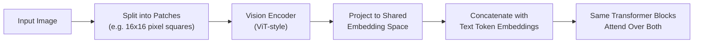

# Multi-Modal AI

## What "Multi-Modal" Actually Means

A multi-modal model processes and/or generates across more than one data type - text, image, audio, video - within a single model, rather than stitching together separate specialized models (an image classifier here, a speech-to-text system there, a text LLM gluing the outputs together). The practical difference matters: a genuinely multi-modal model can reason *across* modalities in one pass - answering a question that requires understanding both an image's content and accompanying text together - rather than converting everything to text first and losing information in the conversion.

Current frontier models with native multi-modal capability include GPT-4o/GPT-5-class models, the Gemini family, and Claude's vision capability. The exact internal architectures of these closed models aren't publicly disclosed in full detail - what follows describes the general pattern used across the field, not a confirmed description of any specific proprietary model's internals.

## How Vision Gets Into an LLM's Context

Text enters a transformer as token embeddings (see [LLM Architecture](llm-architecture.md)). Images need a bridge into that same representation space, and the common approach is a **vision encoder**:

1. The image is divided into a grid of small patches (a Vision Transformer, or **ViT**, typically uses fixed-size square patches).
2. Each patch is run through a vision encoder that produces an embedding for it - conceptually the same kind of vector a text token embedding is, just derived from pixels instead of a vocabulary lookup.
3. A projection step maps those patch embeddings into the *same* embedding space the text tokens live in, so the two are numerically comparable.
4. The combined sequence of (projected) image-patch embeddings and text token embeddings is fed into the same transformer stack, which attends over all of it uniformly - the model has no architectural distinction between "this embedding came from a word" and "this embedding came from a pixel patch" by the time it reaches the attention layers.

## Audio and Video

**Audio** can enter a model two different ways: a **speech-to-text frontend** transcribes audio to text first, then the text-only model processes it normally (simpler, but loses tone, emphasis, and non-speech audio information in the conversion) - or a **native audio-token model** converts the raw audio waveform directly into a sequence of discrete tokens (analogous to how text becomes sub-word tokens) that the same transformer can attend over alongside text, preserving far more of the original signal.

**Video** extends the same patch-embedding idea across time: frames are sampled at some rate, each frame is patch-embedded like a still image, and a temporal dimension is added so the model can relate patches across frames, not just within one. The practical constraint is context length - a few seconds of video sampled at even a modest frame rate produces a very large number of patch embeddings, which is why most current video-understanding systems aggressively downsample frames rather than processing every one.

## Security Angle

Multi-modality doesn't introduce a new category of model vulnerability so much as it widens the **delivery surface** of existing ones. The 2026 edition of the [OWASP Top 10 for LLM Applications](../ai-security/llm-security.md) explicitly broadened **LLM01:2026 Prompt Injection** to cover cross-modal attacks - an instruction hidden in an image's pixels, encoded in a seemingly innocuous audio waveform, or embedded in a video frame reaches the model's context exactly the same way a hidden instruction in a text document does, because by the time it reaches the transformer's attention layers, it's just another embedding in the sequence with no inherent "this came from an untrusted image" flag attached. The practical implication: any application that lets a model process user-supplied or third-party images/audio/video needs the same untrusted-input discipline as one that processes user-supplied text - see [LLM Security: LLM01](../ai-security/llm-security.md#llm01-prompt-injection) for the full treatment.

## Credits/References

1. Dosovitskiy et al., ["An Image is Worth 16x16 Words: Transformers for Image Recognition at Scale"](https://arxiv.org/abs/2010.11929) - the original Vision Transformer (ViT) paper
2. [OWASP Top 10 for LLM Applications 2026](https://genai.owasp.org/llm-top-10/) - LLM01:2026 Prompt Injection, cross-modal scope

## Practice Next

- [LLM Architecture](llm-architecture.md) for the transformer mechanics this extends
- [LLM Security](../ai-security/llm-security.md) for the full cross-modal prompt injection coverage
