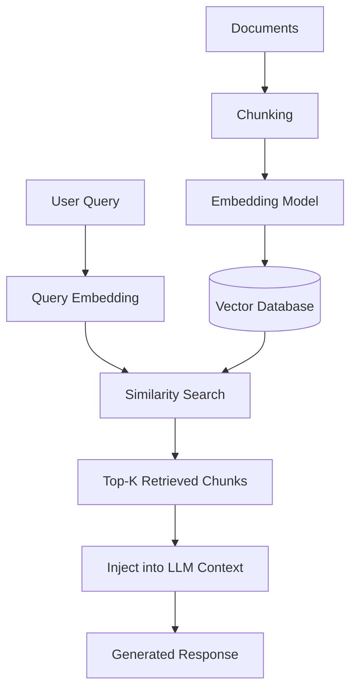

# RAG Architecture

## What RAG Solves

A model's training data has a cutoff date, and retraining or fine-tuning it on every new document your organization produces is slow and expensive. Retrieval-Augmented Generation (RAG) sidesteps both problems: instead of relying purely on what the model memorized during training, you retrieve the most relevant pieces of your own data at query time and hand them to the model as context, letting it answer grounded in information it never saw during training. This directly reduces hallucination (the model has real source material to work from instead of statistically plausible guessing) and eliminates the staleness problem (your knowledge base updates independently of the model's training schedule).

## The Core Pipeline

**Ingestion time** (happens once per document, ahead of any user query):

1. **Chunking** - split documents into smaller pieces, since embedding an entire 50-page PDF as one vector loses too much granularity to retrieve precisely.
2. **Embedding** - each chunk is converted into a vector (a list of numbers representing its meaning) by an embedding model.
3. **Indexing** - the vectors (plus the original text and metadata) are stored in a vector database for fast similarity search later.

**Query time** (happens on every user question):

1. The user's query is embedded using the same embedding model used at ingestion.
2. The vector database runs a **similarity search** (typically cosine similarity or dot product) to find the chunks whose vectors are closest to the query vector.
3. The top-k closest chunks are retrieved and inserted into the LLM's context window alongside the actual question.
4. The model generates its answer grounded in the retrieved text.

## Chunking Strategies

How you split documents materially affects retrieval quality - too large and irrelevant content dilutes the signal; too small and you lose necessary context:

| Strategy | How It Works | Tradeoff |
|----------|----------------|-----------|
| **Fixed-size** | Split every N tokens/characters, often with some overlap between chunks | Simple and fast, but can split a sentence or idea mid-thought |
| **Semantic chunking** | Split at natural boundaries (paragraphs, sections) detected by analyzing where meaning shifts | Produces more coherent chunks, costs more compute to determine boundaries |
| **Recursive/hierarchical chunking** | Try splitting on the largest natural boundary (document → section → paragraph) first, recursing into smaller units only where needed to fit a size limit | Balances coherence and size control, the most common production default |

## Embedding Models

The embedding model determines what "similar" means in your vector search - a weak or mismatched embedding model is a common, under-diagnosed cause of poor RAG retrieval quality. Production systems commonly use either a dedicated embedding API (e.g. OpenAI's `text-embedding-3`, Cohere's `embed` models) or an open-weight model run locally (e.g. BGE, E5, or Nomic Embed variants) - the right choice depends on whether data residency requirements rule out sending your content to a third-party embedding API at all.

## Vector Databases

| Database | Best For |
|----------|----------|
| **[Pinecone](https://www.pinecone.io/)** | Fully-managed, zero-ops at any scale; increasingly bundles embeddings/reranking and hybrid search directly |
| **[Weaviate](https://weaviate.io/)** | Strongest built-in hybrid search (vector + BM25 + metadata filters) story among the major options |
| **[Qdrant](https://qdrant.tech/)** | Open-source, written in Rust; strong sparse-vector (SPLADE) and multi-vector (ColBERT) support, generous free tier |
| **[Milvus](https://milvus.io/)** | Best suited for billions of vectors at lower cost; full control over indexing (HNSW, IVF) but needs real DevOps investment |
| **[pgvector](https://github.com/pgvector/pgvector)** | The pragmatic default if you're already on PostgreSQL and under roughly 10-100M vectors - zero new infrastructure, transactional consistency |

There's no single best choice - it depends on scale, existing infrastructure, and operational capacity, not just raw benchmark numbers.

## Hybrid Search

Pure vector similarity search misses exact keyword/phrase matches that a human would consider obviously relevant - searching for an exact product SKU or error code, for example, where semantic similarity is the wrong tool for the job. **Hybrid search** runs both a dense vector search (semantic similarity) and a sparse/keyword search (BM25, the classic term-frequency ranking algorithm used by traditional search engines) in parallel, then combines the two ranked lists. Most production RAG systems now default to hybrid search rather than pure vector search, because the two approaches fail in different, complementary ways.

## Reranking

Initial retrieval (vector or hybrid) is optimized for speed across a large index, which means it's willing to trade some precision for being fast enough to run on millions of chunks. A **reranker** is a second, more expensive model that takes the initial top-k (say, top-50) candidates and re-scores them more carefully against the actual query, producing a smaller, more precisely-ordered final set (say, top-5) to actually inject into the LLM's context. This two-stage "retrieve broadly, then rerank precisely" pattern is standard in serious production RAG pipelines, not an optional extra.

## Newer Architecture Variants

- **Agentic RAG** - rather than retrieval always running as a fixed step before generation, the model itself decides *whether*, *when*, and *what* to retrieve, treating retrieval as a tool it can call zero, one, or many times depending on the query - including deciding to search multiple different sources or re-query after seeing initial results. This trades predictability for flexibility: a simple factual question might need no retrieval at all, while a complex multi-part question might need several rounds.
- **GraphRAG** - instead of (or in addition to) flat vector similarity, builds a knowledge graph of entities and their relationships from the source documents, then retrieves by traversing that graph. This is significantly better for **multi-hop questions** ("which of our vendors in the EU also supply a company that had a breach last year?") that require connecting facts across multiple documents in a way pure vector similarity on isolated chunks struggles with.

## Security Angle

This architecture-first view is the foundation for [RAG Security](../ai-security/rag-security.md), which covers what breaks at each stage above: poisoned documents injected at ingestion, access-control leakage through retrieval that ignores source-system permissions, embedding-space ranking manipulation, and indirect prompt injection via retrieved chunks. The more autonomy you add - Agentic RAG deciding what to retrieve, GraphRAG traversing relationships automatically - the larger that attack surface gets, not smaller, because each additional retrieval decision is itself an opportunity for an attacker-influenced outcome.

## Credits/References

1. [Cloud Security Alliance: Mitigating Security Risks in RAG](https://cloudsecurityalliance.org/blog/2023/11/22/mitigating-security-risks-in-retrieval-augmented-generation-rag-llm-applications)
2. [pgvector](https://github.com/pgvector/pgvector)
3. [Weaviate Documentation: Hybrid Search](https://weaviate.io/developers/weaviate/search/hybrid)
4. [Microsoft Research: GraphRAG](https://microsoft.github.io/graphrag/)

## Practice Next

- [LLM Architecture](llm-architecture.md) for the model this pipeline feeds context into
- [RAG Security](../ai-security/rag-security.md) for the full attack surface and mitigations
- [Agentic AI Fundamentals](agentic-ai-fundamentals.md) for how Agentic RAG fits into a broader agent loop
