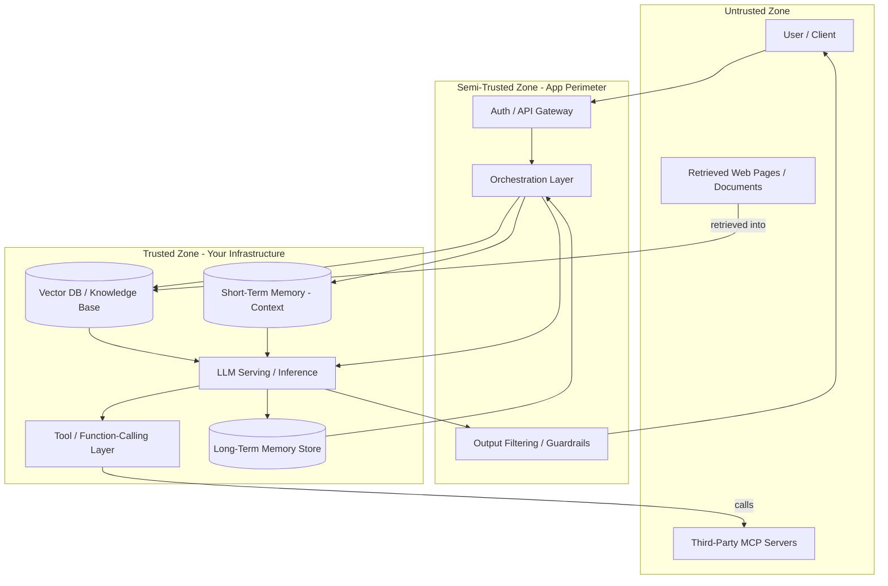
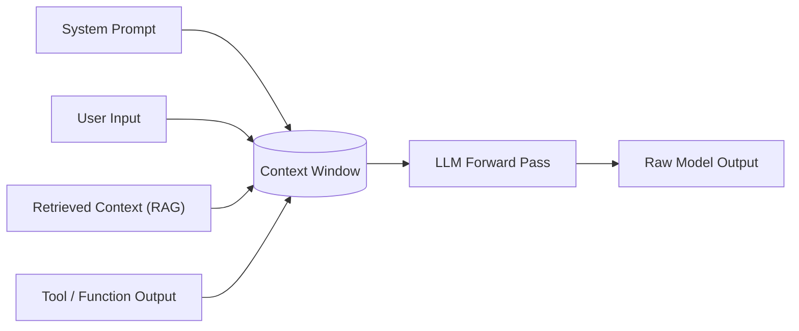
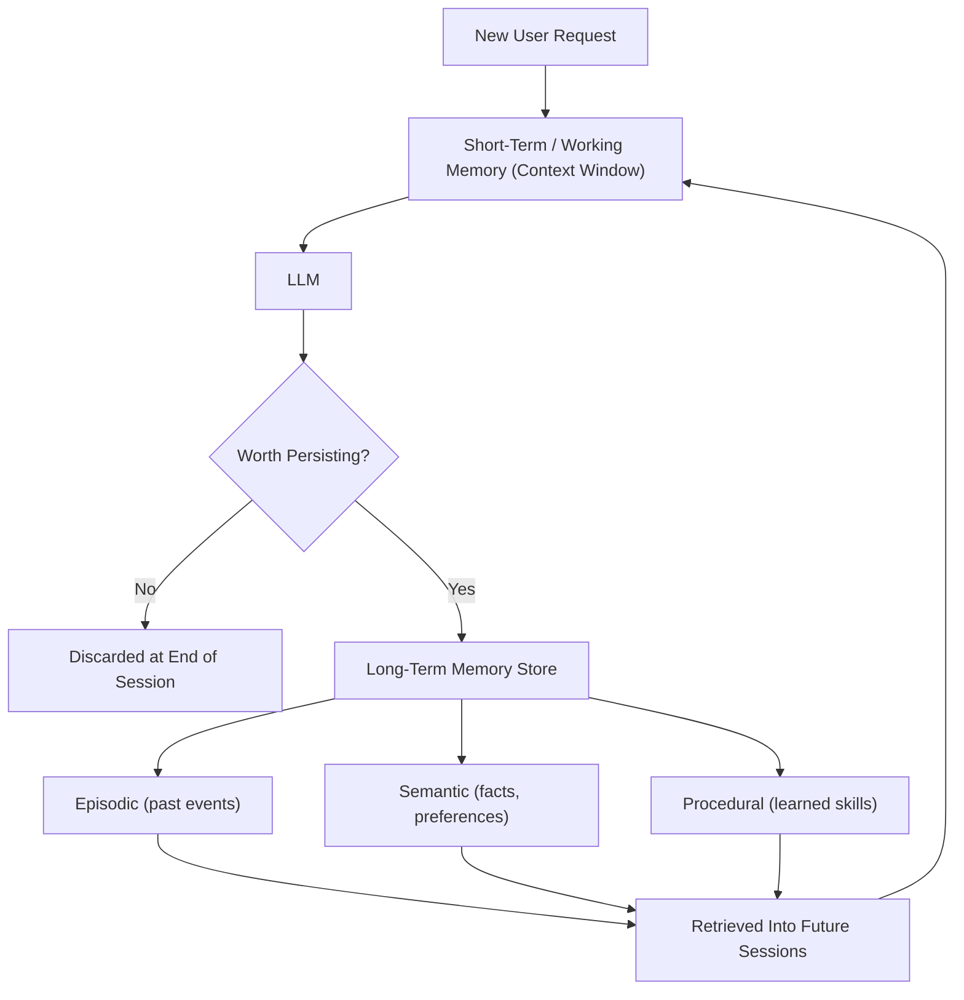
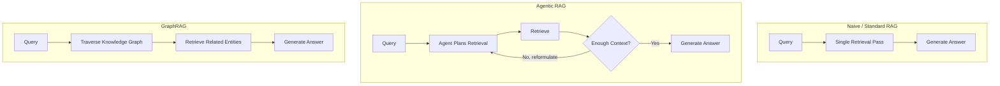
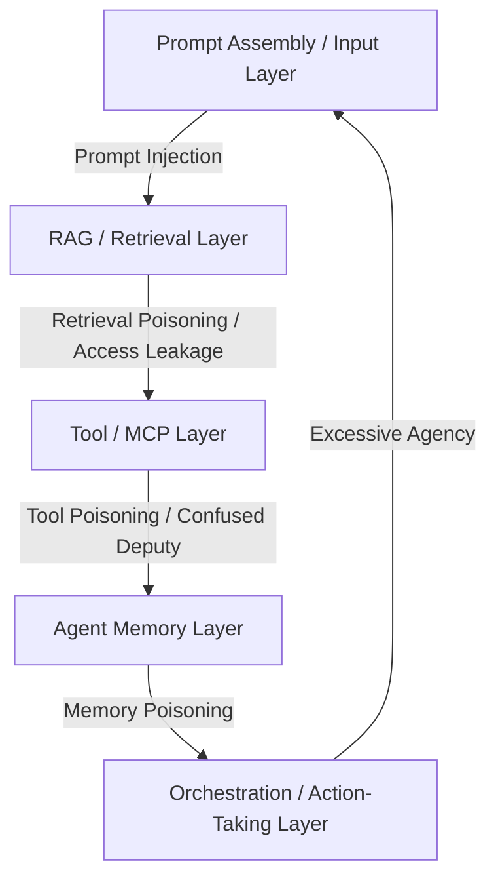

# AI/LLM Security Architecture

This page is written for **security architects** - the goal isn't another attack list (the sibling pages already cover those in depth), it's the *architecture lens*: what are the components of a real GenAI system, how do they connect, where do trust boundaries sit, and what does each major pattern (LLM serving, agent memory, RAG) look like when you draw it as a diagram instead of a paragraph.

## 1. End-to-End GenAI Reference Architecture

Every production GenAI application - chatbot, copilot, or autonomous agent - is some arrangement of the same handful of components. The most useful thing you can do as an architect is draw where trust changes hands.

The point of drawing it this way: **the "Trusted Zone" box is a lie the moment anything untrusted crosses into it and gets treated as trusted.** A retrieved document, a third-party MCP server's tool description, and a message from another agent are all, architecturally, just as untrusted as raw user input - even though they physically arrive from inside your own infrastructure (the vector DB, the tool layer). This single observation is the root of almost every GenAI-specific vulnerability class, and it's why later sections keep coming back to it.

This diagram is the anchor for the rest of the page - Sections 3 and 4 zoom into the memory and RAG boxes, and Section 5 re-labels every box with its primary attack type.

## 2. LLM Architecture - What a Security Architect Needs to Know

You don't need transformer math to reason about this system - you need to know where the architectural seams are.

An agent, at its simplest, has three components (per OpenAI's own guidance on building agents): a **Model** (the LLM doing reasoning/decision-making), **Tools** (external functions/APIs the model can call), and **Instructions** (the guardrails defining how it should behave). Tools further split into three types worth tracking separately for a security review: **Data tools** (read-only retrieval - query a DB, search the web, read a file), **Action tools** (write/mutate - send an email, update a record, execute code), and **Orchestration tools** (an agent calling another agent as a sub-tool). Action tools are where "excessive agency" risk concentrates - see [Agentic AI Security](agentic-ai-security.md).

The architectural fact that matters most for security: **everything that reaches the model - system instructions, the user's message, retrieved documents, and tool output - gets concatenated into one context window before the model ever sees it.**

Once everything is inside that one box, it's all just tokens - the model has no cryptographic or architectural mechanism to distinguish "an instruction I should obey" from "data I should only summarize." This is why prompt injection is not a bug you patch once; it's a structural property of how current LLM systems assemble context. See [LLM Security](llm-security.md) for the full OWASP LLM Top 10 treatment and concrete mitigations (role separation, output filtering).

A joint BSI (Germany) / ANSSI (France) government advisory on Zero Trust for LLM systems models this the same way: a central LLM, an **Orchestrator** mediating access to Frontend/Shell/Plug-in/other-AI-model/Memory-DB-RAG components, with Authentication & Authorization, Monitoring, and Threat Intelligence wrapped around the whole system - and explicitly recommends treating every one of those connections as requiring its own authentication and authorization check, not inheriting trust from the orchestrator.

## 3. Types of Agent Memory - Architecture, Use Cases, Security Challenges

Per Redis/O'Reilly's *Managing Memory for AI Agents* (2025), the industry has converged on a working split between **short-term memory** (the active context window - gone when the session ends) and three sub-types of **long-term memory**: **episodic** (specific past interactions/events, "what happened"), **semantic** (structured facts - user profile, preferences, domain knowledge), and **procedural** (learned skills/workflows - the least mature of the three, sometimes implemented as the agent updating its own system prompt via reflection).

| Memory Type | Use Case | Security Challenge | Attack Example | Mitigation |
|---|---|---|---|---|
| **Short-term (working)** | Holds the current conversation/task state | Anything injected here (via user input, retrieval, or tool output) directly steers the current response | A single malicious message in a long conversation manipulates the rest of that session | Treat context assembly the same as any other untrusted-input boundary (see Section 2) |
| **Episodic** | Recall a specific past interaction ("last time you asked me to...") | Often built by summarizing/embedding raw conversation history - a poisoned past turn can be retrieved and replayed into a *future*, unrelated session | An attacker plants a false "fact" in one session (e.g. "my account tier is admin") that gets retrieved and trusted in a later session | Provenance-tag memory entries (who/what session wrote this), validate on write, not just on retrieval |
| **Semantic** | Store durable facts about a user/domain that should influence future responses | A single semantic fact, once written, can silently affect *every* future interaction - a much larger blast radius than one bad episodic memory | Injecting a false "semantic fact" (e.g. a fabricated permission or preference) that then quietly overrides safety behavior in every later session | Require higher-confidence validation before writing to semantic memory than episodic; periodic review/expiry |
| **Procedural** | The agent's learned skills/workflow shortcuts | If an agent can update its own instructions/prompts ("reflection"), a manipulated interaction can permanently alter its future behavior | An attacker coaxes the agent into "learning" a shortcut that skips an approval step, which then persists across sessions | Never let procedural/self-modifying memory bypass hard-coded guardrails; require human review before self-modified instructions go live |

The scoping question an architect must answer explicitly: is memory **per-user**, **per-session**, or **globally shared across all users of the agent**? Globally shared long-term memory is where a single successful poisoning attack against one user can leak into every other user's sessions - treat any shared-memory design as a high-severity finding unless there's a hard justification and per-write validation in place.

## 4. RAG Architecture Types - Use Cases, Security Challenges

RAG isn't one architecture - the retrieval strategy you pick changes where the security risk sits.

| Pattern | Use Case | How It Works | Primary Security Challenge |
|---|---|---|---|
| **Naive / Standard RAG** | Simple Q&A over a fixed knowledge base; latency-sensitive (1-2s response targets) | Single pass: embed query → similarity search → stuff top-K chunks into the prompt → generate | No natural checkpoint to re-verify authorization mid-flow - if the vector DB doesn't enforce the *source system's* access controls, retrieval silently returns documents the current user shouldn't see |
| **Agentic RAG** | Complex, multi-hop questions where one retrieval pass isn't enough | An agent decides *whether*, *when*, and *how many times* to retrieve, reformulating queries and chaining calls | The agent can be steered by earlier retrieved content into re-querying for something it shouldn't, or driven into an unbounded/costly retrieval loop by adversarial content |
| **GraphRAG** | Questions that depend on entity relationships, not just semantic similarity (e.g. "who reports to whom") | Builds/queries a knowledge graph of entities and relationships instead of (or alongside) flat vector search | Graph poisoning - corrupting entity relationships changes what gets surfaced for *every future query* that touches that part of the graph, a wider blast radius than poisoning a single document chunk |

(Corrective RAG - adding a "is this actually relevant?" grading step before generation - and other variants exist and are worth knowing by name, but the three above are the architecturally distinct patterns that change your threat model.)

In every pattern, the fix for the most common real-world RAG vulnerability is the same: **enforce the source system's access control at retrieval time, per query, not just at ingestion time.** A document being "in the index" is not the same as the current user being allowed to see it. See [RAG Security](rag-security.md) for the full attack/mitigation treatment.

## 5. Consolidated Attack-Surface Map

Re-labeling the Section 1 architecture by primary attack type, with links to the deep-dive page for each layer:

Click any box to jump to that layer's full attack/defense writeup.

## 6. Architect's Review Checklist

- [ ] Every external input source (user, retrieved documents, tool/MCP output, other agents) has an explicitly documented trust boundary - none are silently treated as trusted because they arrive from "inside" your infrastructure
- [ ] There's a clear identity/permission model distinguishing what the LLM/agent's own credentials can access vs. what the *calling user* is allowed to access (the confused-deputy pattern - see [MCP Security](mcp-security.md))
- [ ] Memory is scoped appropriately - per-user or per-session by default; any globally shared memory has an explicit justification and write-time validation
- [ ] High-impact actions (financial transactions, data deletion, production deploys, irreversible changes) require human-in-the-loop approval, not just a policy the agent is told to follow
- [ ] Output is filtered/validated before it reaches users or downstream systems (system-prompt leakage checks, PII redaction, action confirmation)
- [ ] Every layer (input, retrieval, tool calls, memory writes, actions taken) is logged with enough detail to reconstruct an incident after the fact
- [ ] RAG retrieval enforces the source system's access control per-query, not just at ingestion
- [ ] Third-party components (MCP servers, plugins, fine-tuned models) are treated as untrusted supply chain until reviewed - see [AI Supply Chain Security](ai-supply-chain-security.md)

## Credits/References

1. Federal Office for Information Security (BSI, Germany) & ANSSI (France), [Design Principles for LLM-based Systems with Zero Trust](https://www.bsi.bund.de/) - reference LLM system architecture diagram and Zero Trust design principles (Authentication & Authorization, Least Privilege, No Implicit Trust)
2. OpenAI, [A Practical Guide to Building Agents](https://cdn.openai.com/business-guides-and-resources/a-practical-guide-to-building-agents.pdf) - agent component model (Model/Tools/Instructions) and tool taxonomy (Data/Action/Orchestration)
3. Labaschin, Wallace, Brookins & Singh, *Managing Memory for AI Agents* (O'Reilly, 2025) - episodic/semantic/procedural long-term memory taxonomy
4. Cloud Security Alliance, [MAESTRO - Agentic AI Threat Modeling Framework](https://cloudsecurityalliance.org/blog/2025/02/06/agentic-ai-threat-modeling-framework-maestro)
5. Microsoft, [Threat Modeling AI/ML Systems and Dependencies](https://learn.microsoft.com/en-us/security/engineering/threat-modeling-aiml)

## Continue Learning

- [AI Preliminary Concepts](ai-preliminary-concepts.md) - if the terms in Section 2 felt unfamiliar, start here
- [LLM Security](llm-security.md) - OWASP LLM Top 10 deep dive
- [RAG Security](rag-security.md) and [MCP Security](mcp-security.md) - layer-specific attack/defense detail
- [Agentic AI Security](agentic-ai-security.md) - memory poisoning, excessive agency, multi-agent attacks
- [AI Threat Modeling](../product-security/application-security/threat-modeling.md) - the general STRIDE/DFD methodology this page's diagrams build on
- [AI Supply Chain Security](ai-supply-chain-security.md) - securing the third-party components this architecture depends on
