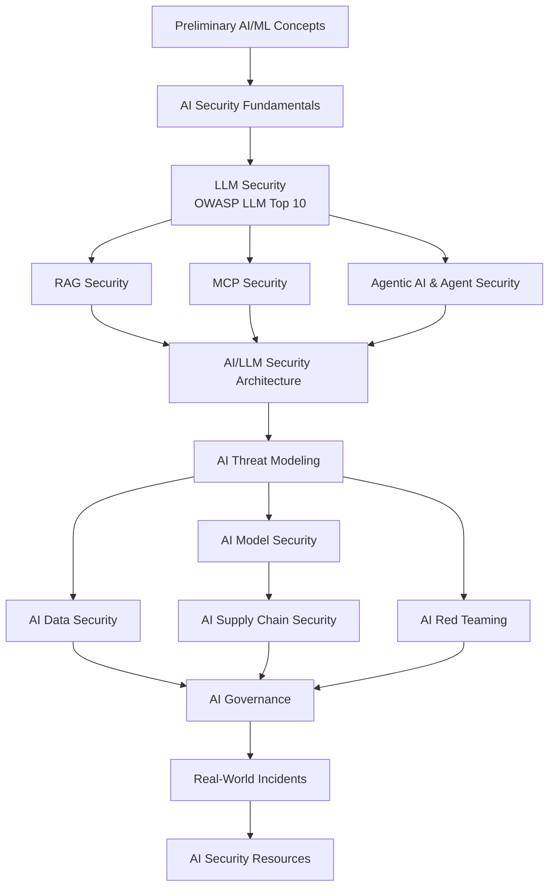

# AI Security Overview

AI Security is the discipline of protecting AI/ML systems - and everything built on top of them (LLM applications, RAG pipelines, MCP-connected tools, autonomous agents) - from attackers, while building systems trustworthy enough to actually deploy. This section is a **zero-to-hero path**: start with no ML background and work through to architecture-level reasoning, red teaming, governance, and real-world incident analysis.

!!! tip "New to AI/ML entirely?"
    Start with [Preliminary AI/ML Concepts](ai-preliminary-concepts.md) even if you're an experienced security engineer - the rest of this section assumes you know what a token, an embedding, and a context window are, and why those specific concepts are the root cause of most LLM-specific attacks.

## Why AI Security Matters

AI systems introduce attack surface that doesn't exist in traditional software, on top of all the attack surface that does:

- **Prompt injection** - untrusted text (user input, retrieved documents, tool output) can override an AI system's intended behavior, because everything ends up as tokens in the same context window with no cryptographic way to separate "instruction" from "data"
- **Excessive agency** - agentic systems that can take real-world actions (delete data, send money, deploy code) turn a model output error into an operational incident, not just a wrong answer
- **Data & model poisoning** - training data, fine-tuning data, or long-term agent memory can be corrupted to manipulate future behavior
- **Model & pipeline theft/tampering** - proprietary models, and the supply chain that builds/serves them, are now valuable and attackable assets in their own right
- **Privacy leakage** - models can memorize and later regurgitate sensitive training or retrieved data to unauthorized users

Real incidents already exist across every one of these categories - see [Real-World AI Security Incidents](ai-security-incidents.md) for a curated, sourced timeline.

## The Learning Path

## AI Security Domains

| Stage | Page | Focus |
|-------|------|-------|
| 0 | [Preliminary AI/ML Concepts](ai-preliminary-concepts.md) | Tokens, embeddings, transformers, training vs. inference - the vocabulary everything else assumes |
| 1 | [AI Security Fundamentals](ai-security-fundamentals.md) | Attack taxonomy across data/model/inference layers |
| 2 | [LLM Security](llm-security.md) | OWASP Top 10 for LLM Applications, category-by-category with real incidents |
| 3 | [RAG Security](rag-security.md) | Retrieval poisoning, access-control leakage, embedding attacks |
| 3 | [MCP Security](mcp-security.md) | Tool poisoning, confused deputy attacks, third-party MCP server risk |
| 3 | [Agentic AI & Agent Security](agentic-ai-security.md) | OWASP Agentic AI threats, excessive agency, multi-agent attacks, memory poisoning |
| 4 | [AI/LLM Security Architecture](ai-llm-security-architecture.md) | Reference architecture, trust boundaries, agent memory types, RAG variants - for security architects, with diagrams |
| 5 | [AI Threat Modeling](ai-threat-modeling.md) | STRIDE-for-AI, worked example |
| 6 | [AI Data Security](ai-data-security.md) | Training/inference data protection, privacy-preserving techniques |
| 6 | [AI Model Security](ai-model-security.md) | Model extraction, inversion, adversarial robustness |
| 7 | [AI Supply Chain Security](ai-supply-chain-security.md) | Malicious model files, SLSA, AI/ML SBOMs |
| 8 | [AI Red Teaming](ai-red-teaming.md) | Methodology, tools (Garak/PyRIT/promptfoo), practice labs |
| 9 | [AI Governance](ai-governance.md) | EU AI Act, NIST AI RMF, model cards, risk assessment |
| 10 | [Real-World AI Security Incidents](ai-security-incidents.md) | Curated, sourced timeline mapped to attack categories |
| 11 | [AI Security Resources](ai-security-resources.md) | Standards, papers, tools, labs, courses - go deeper on any topic above |

## Key Frameworks and Standards

- **OWASP Top 10 for LLM Applications** - the standard risk taxonomy for LLM-integrated apps (see [LLM Security](llm-security.md))
- **OWASP Top 10 for Agentic Applications** - the emerging equivalent for autonomous/agentic systems (see [Agentic AI & Agent Security](agentic-ai-security.md))
- **MITRE ATLAS** - Adversarial Threat Landscape for AI Systems, a real-world ATT&CK-style knowledge base for AI attacks
- **NIST AI RMF (AI 600-1 GenAI Profile)** - risk management framework and GenAI-specific profile
- **SLSA** - supply-chain integrity levels, increasingly applied to model artifacts (see [AI Supply Chain Security](ai-supply-chain-security.md))
- **EU AI Act, ISO/IEC 42001** - regulatory and management-system standards (see [AI Governance](ai-governance.md))

## Practice Next

- [AI Security Interview Questions](../interview-questions/ai-security-interview-questions.md) - self-test on attack taxonomy, prompt injection, and governance
- [GenAI Security Study Plan](../study-plan/specialized/genai-security-study-plan.md) - a structured, week-by-week path through this domain
- [awesome-genai-security](https://github.com/jassics/awesome-genai-security) for curated further reading
- [awesome-claude-security](https://github.com/jassics/awesome-claude-security) - a Claude Code plugin marketplace with dedicated LLM/RAG/agentic-AI security skills you can install and run directly
