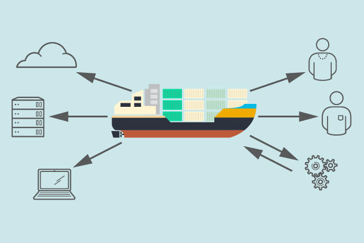
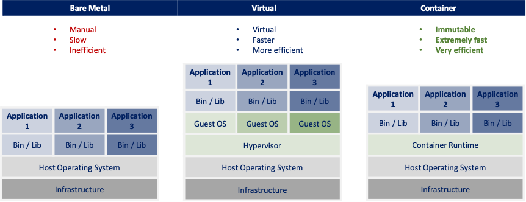

# Containers Overview

## What are Containers?
Containers are packages of software that contain all of the necessary elements to run in any environment.
Containerization allows development teams to move fast, deploy software efficiently, and operate at an unprecedented scale.

Containers are lightweight packages of your application code together with dependencies such as specific versions of programming language runtimes and libraries required to run your software services.
Containers make it easy to share CPU, memory, storage, and network resources at the operating systems level and offer a logical packaging mechanism in which applications can be abstracted from the environment in which they actually run.

## What is Bare Metal?
The term bare metal refers to the fact that there is no operating system between the virtualization software and the hardware. The virtualization software resides on the “bare metal” or the hard disk of the hardware, where the operating system is usually installed.

## Containers vs Virtual Machine
You might already be familiar with VMs: a guest operating system such as Linux or Windows runs on top of a host operating system with access to the underlying hardware. 
Containers are often compared to virtual machines (VMs). Like virtual machines, containers allow you to package your application together with libraries and other dependencies, providing isolated environments for running your software services. 

Multiple containers can be run on the same machine, and usually consume less space than VMs, apart from being quicker to start. 

As you’ll see below, however, the similarities end here as containers offer a far more lightweight unit for developers and IT Ops teams to work with, carrying a myriad of benefits.

- Containers are much more lightweight than VMs
- Containers virtualize at the OS level while VMs virtualize at the hardware level
- Containers share the OS kernel and use a fraction of the memory VMs require

**Below image explains Bare Metal vs Virtual Machine vs Container:**

## Benefits of using Containers
**Separation of responsibility**

Containerization provides a clear separation of responsibility, as developers focus on application logic and dependencies, 
while IT operations teams can focus on deployment and management instead of application details such as specific software versions and configurations.

**Workload portability**

Containers can run virtually anywhere, greatly easing development and deployment: 
on Linux, Windows, and Mac operating systems; on virtual machines or on physical servers; 
on a developer’s machine or in data centers on-premises; and of course, in the public cloud. 

**Application isolation**

Containers virtualize CPU, memory, storage, and network resources at the operating system level, 
providing developers with a view of the OS logically isolated from other applications.

**Agile development**

Containers allow your developers to move much more quickly by avoiding concerns about dependencies and environments.

**Efficient operations**

Containers are lightweight and allow you to use just the computing resources you need. This lets you run your applications efficiently.

**Run anywhere**

Containers are able to run virtually anywhere. Wherever you want to run your software, you can use containers.

## Container use cases
Common ways organizations use containers include:

1. **"Lift and shift" existing applications into modern cloud architectures** 

    Some organizations use containers to migrate existing applications into more modern environments. While this practice delivers some of the basic benefits of operating system virtualization, it does not offer the full benefits of a modular, container-based application architecture.

2. **Refactor existing applications for containers**

    Although refactoring is much more intensive than lift-and-shift migration, it enables the full benefits of a container environment.

3. **Develop new container-native applications**

    Much like refactoring, this approach unlocks the full benefits of containers.

4. **Provide better support for microservices architectures**

    Distributed applications and microservices can be more easily isolated, deployed, and scaled using individual container building blocks. 

5. **Provide DevOps support for continuous integration and deployment (CI/CD)**

    Container technology supports streamlined build, test, and deployment from the same container images.

6. **Provide easier deployment of repetitive jobs and tasks**

    Containers are being deployed to support one or more similar processes, which often run in the background, such as ETL functions or batch jobs.

## What are some examples of containers
**Some examples include:** 

1. Container Linux (formerly CoreOS Linux) — one of the first lightweight container operating systems built for containers. 
2. RancherOS — a simplified Linux distribution built from containers, specifically for running containers
3. Docker - The first and still most popular container technology, Docker's open-source containerization engine works with most of the products that follow, as well as many open-source tools.

## How do docker and Kubernetes relate to containers?
Users involved in container environments are likely to hear about two popular tools and platforms used to build and manage containers. These are Docker and Kubernetes.

Docker is a popular runtime environment used to create and build software inside containers. It uses Docker images (copy-on-write snapshots) to deploy containerized applications or software in multiple environments, from development to test and production. Docker was built on open standards and functions inside most common operating environments, including Linux, Microsoft Windows, and other on-premises or cloud-based infrastructures.

Containerized applications can get complicated, however. When in production, many might require hundreds to thousands of separate containers in production. This is where container runtime environments such as Docker benefit from the use of other tools to orchestrate or manage all the containers in operation.

One of the most popular tools for this purpose is Kubernetes, a container orchestrator that recognizes multiple container runtime environments, including Docker.

Kubernetes orchestrates the operation of multiple containers in harmony together. It manages areas like the use of underlying infrastructure resources for containerized applications such as the amount of compute, network, and storage resources required. 
Orchestration tools like Kubernetes make it easier to automate and scale container-based workloads for live production environments.

## Credits/References
1. [Google Cloud for Containers](https://cloud.google.com/learn/what-are-containers)
2. [NetAPP DevOps](https://www.netapp.com/devops-solutions/what-are-containers/)
3. [CNCF: Cloud Native Computing Foundation](https://www.cncf.io/)
4. [vmware.com](https://www.vmware.com/)
5. [Container Journal](https://containerjournal.com/)