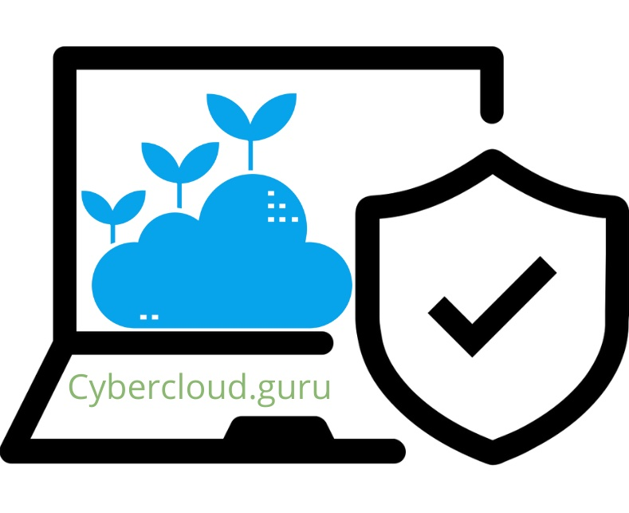

# Welcome to Cybercloud Learnings

    

## Introduction
Cybercloud Learning is trying to put simple yet practical contents which can be used by beginners or experienced  professionals as a revision or skills update. The goal is to share the knowledge with the cloud and cybersecurity community to better understand offensive and defensive approach on cloud native technologies.

All content on this site is developed by volunteers like us. If you'd like to be one of them, you can contribute your knowledge by submitting a [Pull Request](https://github.com/jassics/CybercloudLearning/pulls). We are open to content from any SMEs or educational institutes. 

Don't worry about submitting content in the wrong format or what section it should be a part of, we can always make improvements later :) When writing content: do try to credit the researcher who discovered it and link to their site/talk.

> Inspired by hackingthe.cloud

Please note that we will not explain basics concept or non-security concepts in-depth because our main target is to make this website for security related skills required using other technologies like terraform, cloud etc.
However, we wil make sure that we would cover minimal basic knowledge required to understand any concepts.

## Which tutorials we cover
We cover topics related to Application Security, Cloud Security, DevSecOps, AI Security and more:

### 1. Product Security
- **Web Security** - OWASP Top 10, Web Security Concepts
- **Network Security** - Network Security Fundamentals
- **Application Security** - Secure Coding, Code Review, Cryptography, Threat Modeling, API Security, SAST, SCA
- **Cloud Security** - AWS, GCP, Azure Security
- **Container Security** - Docker, Kubernetes Security
- **DevSecOps** - SDL, SCA, DAST in CI/CD, Compliance as Code

### 2. AI Security
- AI Security Fundamentals
- AI Threat Modeling
- AI Data Security
- AI Model Security
- AI Governance

### 3. GRC (Governance, Risk & Compliance)
- ISO/IEC 27001:2022
- NIST CSF & NIST RMF
- GDPR & Data Privacy

### 4. Python Track
- Learning Python
- Python for AWS
- Python for Cybersecurity
- Python for Automation
- Python for DevOps

### 5. Study Plans
- Application Security, Web Security, Network Security
- DevSecOps, Docker & Kubernetes Security
- AWS, GCP, Azure Security

### 6. Miscellaneous
- Linux Commands
- ViM for Everyone
- Regular Expression Essentials
- Git Essentials

### 7. Slides & Presentations
- Cybersecurity Roadmaps
- OWASP Top 10 (Web & API)
- Cloud Security & Penetration Testing

## Disclaimer
The information here provided by Cybercloud Gurus is only for educational purpose.
You should do labs and run commands etc. on your own cloud environment or local machine wherever you are authorized.

## Roadmap
It's just the beginning and every week I will update more contents.
Please check [GitHub page](https://github.com/jassics/CybercloudLearning) for more information and instructions!

## Contributors
- [Sanjeev Jaiswal](https://sanjeevjjaiswal.com)

> You can help us to improve further if you find any discrepancies in existing content through an [Issue](https://github.com/jassics/CybercloudLearning/issues) or submit the new content through a [Pull Request (PR)](https://github.com/jassics/CybercloudLearning/pulls).

It can't be better when developed by a community builder. If you are willing to contribute, don't hesitate and let's start helping the community.
It can be even a suggestion, writing only on one topic or a coe snippet, screenshots etc. or even something typo!

!!! tip "Quality Content is our motto!"

    The content on this site is generated by SMEs like you who share Cybercloud and security knowledge with us.
    Are you familiar with any of these topics or technologies and want to join as a contributor? 

