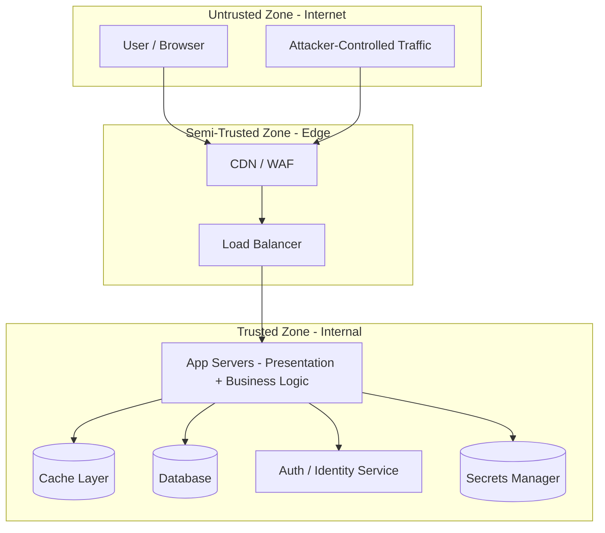
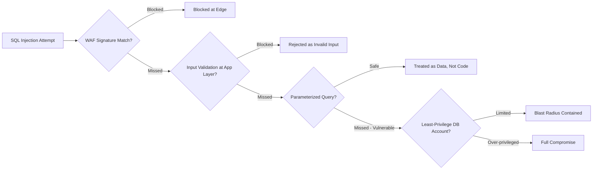
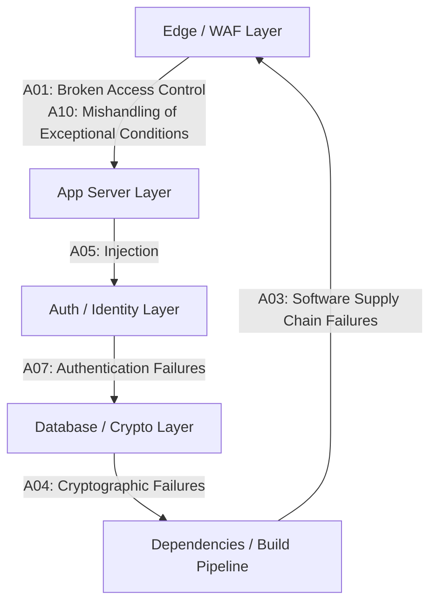

# Secure Application Architecture

This page is written for **security architects** - the goal isn't another vulnerability list (the sibling pages already cover those in depth), it's the *architecture lens*: what are the components of a real application, where do trust boundaries sit, and how do you verify "how secure does this system actually need to be" instead of applying a one-size-fits-all bar.

## 1. Reference Architecture

Most production web applications are some arrangement of the same handful of tiers and supporting services.

The point of drawing it this way: the "Trusted Zone" label is only true as long as every request crossing into it from the DMZ is re-validated (authenticated, authorized, input-checked) rather than inherited as trusted just because it made it past the edge. A WAF catching *most* attacks is not the same as the app tier being safe to trust blindly - see [Defense in Depth](#2-defense-in-depth-in-practice) below.

## 2. Defense in Depth in Practice

The same attack should be catchable at multiple, independent layers - so that one control failing doesn't mean total compromise.

Four independent layers, each catching what the previous one missed: edge filtering (WAF), input validation (app), safe query construction (data-access layer), and least-privilege database credentials (limiting blast radius even if the first three all fail). An architecture review that only checks "is there a WAF" and stops there hasn't verified defense in depth - it's verified one layer.

## 3. Secure Design Principles

| Principle | What It Means | Architectural Example |
|-----------|----------------|-------------------------|
| **Fail securely** | On error, default to denying access, not granting it | An auth check that throws an exception should deny the request, not fall through to an implicit allow (see [OWASP Top 10 A10: Mishandling of Exceptional Conditions](../web-security/owasp-top10.md)) |
| **Least privilege** | Every component gets the minimum access it needs | The app's DB account can't `DROP TABLE`; a microservice's IAM role can only touch the specific queue/bucket it needs |
| **Defense in depth** | No single control is the only thing standing between an attacker and a breach | See Section 2 above |
| **Separation of duties** | No single component/role can complete a sensitive action alone | Code deploys require both a passing CI pipeline AND a human approval - a compromised CI token alone can't ship to prod |
| **Complete mediation** | Every access to a resource is checked, every time - no caching a "yes" from an earlier check | Re-validating authorization on every request, not just at session start |
| **Minimize attack surface** | Fewer exposed endpoints/features/ports means fewer things to secure and fewer things that can be misconfigured | Internal admin endpoints on a separate network path, not reachable from the public internet at all |
| **Secure defaults** | The out-of-the-box configuration is the secure one; insecure options require an explicit, documented opt-in | New S3 buckets/storage default to private; TLS is on by default, not something a developer has to remember to enable |

## 4. OWASP ASVS as an Architecture Verification Tool

The Application Security Verification Standard (ASVS) is a list of ~350 verifiable security requirements (version 5.0, May 2025) organized into 17 chapters (encoding/sanitization, validation/business logic, authentication, session management, authorization, cryptography, secure communication, configuration, data protection, secure coding/architecture, logging/error handling, and more).

Its real value for an architect isn't the individual requirements - it's the **three-level structure**, which answers "how secure does THIS system need to be" instead of assuming every system needs maximum security:

| Level | Coverage | Who It's For |
|-------|----------|---------------|
| **L1** | ~20% of requirements - critical, first-layer-of-defense controls | The minimum baseline for any application handling any sensitive data |
| **L2** | ~50% of requirements (≈70% cumulative with L1) | Most applications should target this - standard practice for less-common attacks and more complete protection |
| **L3** | The remaining ~30% - defense-in-depth and high-assurance controls | High-value targets: banking, healthcare, critical infrastructure - where an early-stage startup with limited sensitive data would reasonably stay at L1/L2, a bank's online banking app would struggle to justify anything less than L3 |

Use ASVS at design time to **explicitly choose and document** a target level per system based on data sensitivity and risk - not as an afterthought during a pre-launch audit.

## 5. OWASP SAMM - The Organizational Counterpart

Where ASVS assesses a **system's** security requirements, the Software Assurance Maturity Model (SAMM) assesses your **organization's** AppSec practice maturity across five business functions (Governance, Design, Implementation, Verification, Operations). An architect uses ASVS to answer "is this specific application secure enough," and points to SAMM to answer "is our organization's overall practice of building secure software maturing over time" - they're complementary, not competing, standards.

## 6. Consolidated Attack-Surface Map

Re-labeling the Section 1 architecture with the primary OWASP Top 10:2025 risk category at each layer, with links to the deep-dive page:

Click any box to jump to that layer's full attack/defense writeup.

## 7. Architect's Review Checklist

- [ ] Every trust boundary (internet → edge, edge → app, app → data) is explicitly documented, not assumed
- [ ] WAF/edge protections are in place, but no control downstream assumes the WAF caught everything (defense in depth is verified, not just claimed)
- [ ] Secrets are never in code or config files - a secrets manager issues short-lived credentials per service
- [ ] Every service/tier has a least-privilege identity - no shared "god mode" database or IAM account
- [ ] An ASVS level (L1/L2/L3) has been explicitly chosen and documented for this system's risk tier, not left implicit
- [ ] Error handling fails closed by default (see [OWASP Top 10 A10](../web-security/owasp-top10.md))
- [ ] The organization tracks its own AppSec maturity (SAMM) separately from any single system's verification level (ASVS)

## Credits/References

1. [OWASP Application Security Verification Standard (ASVS) 5.0](https://owasp.org/www-project-application-security-verification-standard/)
2. [OWASP Software Assurance Maturity Model (SAMM)](https://owaspsamm.org/)
3. [OWASP Secure Coding Practices Quick Reference Guide](https://owasp.org/www-project-secure-coding-practices-quick-reference-guide/)
4. [OWASP Proactive Controls](https://owasp.org/www-project-proactive-controls/)

## Continue Learning

- [Secure Coding](secure-coding.md) and [Secure Code Review](secure-code-review.md)
- [Threat Modeling](threat-modeling.md) - the methodology this page's diagrams build on
- [Authentication Security](authentication-security.md) and [Authorization & Access Control](authorization-security.md)
- [Injection & Input Validation](injection-security.md)
- [Cryptography](cryptography.md) and [SCA](sca.md)
- [OWASP Top 10:2025](../web-security/owasp-top10.md)
