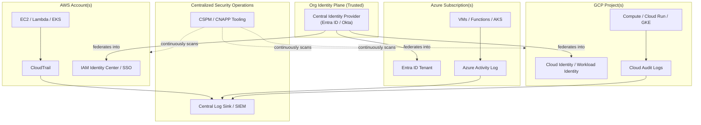
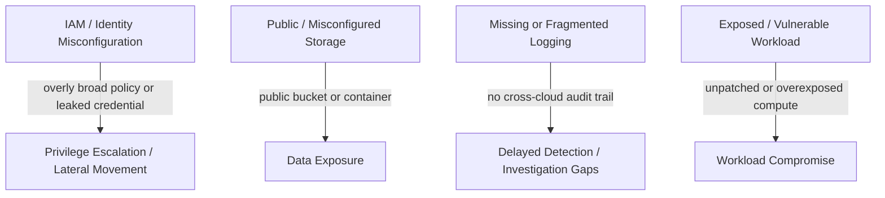

# Multi-Cloud Security Architecture

This page is written for **security architects** working across more than one cloud, or designing controls meant to scale across AWS/Azure/GCP. [Cloud Security Essentials](cloud-security-essentials.md) already covers the shared responsibility model and IAM/data fundamentals - this page is the *architecture lens*: how do you reason about posture, identity, and attack surface when "the cloud" is actually three (or more) clouds with three different consoles, APIs, and log formats.

## 1. CSPM, CWPP, and CNAPP

Three acronyms that get thrown around interchangeably but describe different (and increasingly converging) categories:

| Category | What It Actually Checks | Real Examples |
|----------|---------------------------|-----------------|
| **CSPM** (Cloud Security Posture Management) | Cloud **configuration** against best practices/compliance - "is this bucket public," "is MFA enforced on this account" | [Prowler](https://github.com/prowler-cloud/prowler), [ScoutSuite](https://github.com/nccgroup/ScoutSuite) (open source); AWS Security Hub, Microsoft Defender for Cloud, Security Command Center (provider-native) |
| **CWPP** (Cloud Workload Protection Platform) | The **running workload itself** - VM, container, or serverless function - for runtime threats (malware, anomalous process behavior) | Falco (containers), GuardDuty (AWS workload/runtime findings), Microsoft Defender for Servers |
| **CNAPP** (Cloud-Native Application Protection Platform) | The converged category: CSPM + CWPP + vulnerability management + identity risk + sometimes CI/CD/IaC scanning, in one platform | Wiz, Orca Security, Cortex Cloud (formerly Prisma Cloud), CrowdStrike Falcon Cloud Security, Lacework |

The practical distinction that matters architecturally: CSPM answers "is anything misconfigured right now," CWPP answers "is anything actively being attacked right now," and CNAPP is the industry's attempt to stop making you buy and correlate both separately. A mature program needs the *capability*, whether that's one CNAPP platform or Prowler plus GuardDuty stitched together.

## 2. Reference Multi-Cloud Architecture

A realistic architecture for an organization running workloads across multiple providers, centered on identity and centralized visibility:

The trust boundary that matters most here is between the **org identity plane** (solid box) and each provider's **control plane** (the dotted-boundary clouds) - everything downstream of the identity provider inherits whatever trust was placed in it.

## 3. Identity Federation Is a Single Point of Failure - By Design

Centralizing identity is the right call (one MFA policy, one place to disable a compromised account, one audit trail for "who has access to what") - but it also means **the central identity provider becomes the single most valuable target in the entire architecture**. If Entra ID or Okta is compromised, an attacker doesn't need to separately breach AWS, Azure, and GCP - federated trust does that work for them.

Architectural implications:

- The identity provider itself needs the *strongest* controls in the whole environment (phishing-resistant MFA, no legacy auth protocols, aggressive conditional access, break-glass accounts stored offline).
- Federated role/permission assignments in each cloud should still follow least privilege - federation is an authentication convenience, not a reason to grant broader authorization than a workload needs.
- Incident response plans must assume "if the IdP is compromised, treat every connected cloud as potentially compromised" rather than investigating clouds in isolation.

## 4. Shared Responsibility Shifts Further Right for Serverless

[Cloud Security Essentials](cloud-security-essentials.md#the-shared-responsibility-model) already covers the IaaS/PaaS/SaaS shared-responsibility table. Serverless compute compresses "your responsibility" even further than a typical PaaS:

| Compute Model | Example | You Still Own |
|----------------|---------|-----------------|
| IaaS (VM) | EC2, Azure VM, GCP Compute Engine | OS patching, runtime, dependencies, code, IAM, network config |
| Managed container (PaaS-ish) | ECS/Fargate, Azure Container Apps, GCP Cloud Run | Runtime config, dependencies, code, IAM, container image |
| Function-as-a-Service | AWS Lambda, Azure Functions, GCP Cloud Functions | Code, dependencies, IAM/execution-role scoping, event-source configuration |

Even at the FaaS end of the spectrum, the provider patching the underlying OS does **not** mean you're off the hook - a Lambda function with an overly broad execution role, or a dependency with a known CVE bundled into the deployment package, is entirely your responsibility regardless of how "serverless" the compute model looks.

## 5. Attack-Surface Map

Click any node to jump to the relevant deep-dive - the AWS pages are the most built-out today; the same risk categories apply directly to Entra ID/RBAC, Storage Accounts, and Cloud IAM/Storage on Azure and GCP respectively.

## Architect's Checklist

- [ ] A single, centralized identity provider federates into every connected cloud, with phishing-resistant MFA enforced at the IdP level
- [ ] CSPM/CNAPP tooling covers **every** cloud account/subscription/project in use - not just the primary one
- [ ] Logs from every provider (CloudTrail, Azure Activity Log, GCP Audit Logs) are aggregated into one central sink, not reviewed in three separate consoles
- [ ] The shared-responsibility boundary is documented per service type in use, including serverless
- [ ] Incident response runbooks explicitly account for cross-cloud pivoting via federated identity, not just single-cloud scenarios
- [ ] Least privilege is enforced per-cloud even though identity is federated - federation is not a justification for broader access

## Credits/References

1. [NIST SP 800-210: General Access Control Guidance for Cloud Systems](https://csrc.nist.gov/publications/detail/sp/800-210/final)
2. [MITRE ATT&CK for Cloud](https://attack.mitre.org/matrices/enterprise/cloud/)
3. [CSA Cloud Controls Matrix](https://cloudsecurityalliance.org/research/cloud-controls-matrix/)
4. [Google Cloud Security Foundations Blueprint](https://cloud.google.com/architecture/security-foundations)

## Continue Learning

- [Cloud Security Essentials](cloud-security-essentials.md) - shared responsibility model and IAM/data fundamentals
- [OWASP Top 10 Cloud](owasp-top10-cloud.md) - common cloud misconfiguration risk categories
- [AWS Security Overview](learning-aws-security/aws-security-overview.md) · [Azure Security Overview](learning-azure-security/azure-security-overview.md) · [GCP Security Overview](learning-gcp-security/gcp-security-overview.md)
- [Cloud Security Incidents](cloud-security-incidents.md) - real multi-cloud/identity incidents this architecture is meant to prevent
