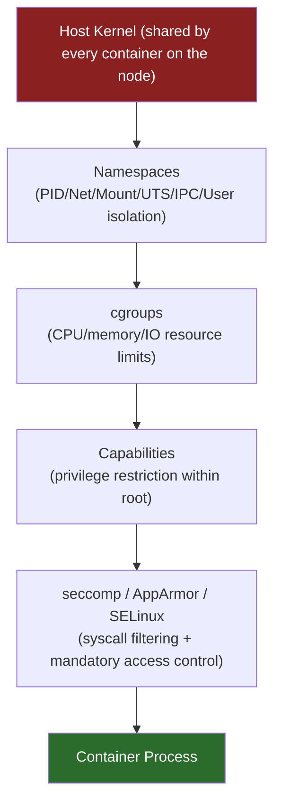

# Docker & Container Isolation Architecture

This page is written for **security architects** - not another hardening checklist ([Docker Security](docker-security.md) already covers Dockerfile hardening, runtime flags, image scanning, and Docker Bench in depth). This page answers a different question: **how does container isolation actually work under the hood, and where is it weaker than people assume?**

## Why This Matters

"Container" isn't a kernel primitive - Linux has no `container` system call. A container is a regular process wrapped in a stack of independent kernel features: namespaces, cgroups, capabilities, and syscall/MAC filtering. Understanding these layers separately is what lets you reason about *which* layer failed when someone asks "how did the attacker escape the container?"

## 1. Linux Namespaces - What's Actually Isolated

Namespaces partition a global kernel resource so a process inside the namespace sees its own private view of it.

| Namespace | What It Isolates | Security Implication If Misconfigured |
|-----------|--------------------|------------------------------------------|
| **PID** | Process IDs and the process tree | Sharing the host PID namespace (`hostPID: true` / `--pid=host`) lets a container see and signal *every* process on the host, including sending it a kill signal |
| **Network** | Network interfaces, routing tables, ports | Sharing the host network namespace (`hostNetwork: true` / `--net=host`) removes network isolation entirely - the container binds directly to host interfaces and can sniff host traffic |
| **Mount** | Filesystem mount points | A `hostPath`/bind-mount of a sensitive host path (`/`, `/etc`, the container runtime's socket) hands the container direct read/write access to the host filesystem |
| **UTS** | Hostname and domain name | Low security relevance on its own, but sharing it can leak host identity to a workload that shouldn't need it |
| **IPC** | Inter-process communication (shared memory, semaphores) | Sharing the host IPC namespace exposes host shared-memory segments to the container |
| **User** | UID/GID mapping between container and host | Without user namespace remapping, root (UID 0) *inside* the container maps to root (UID 0) *on the host* for anything the container's capabilities allow - user namespaces let you map container-root to an unprivileged host UID, a meaningful extra layer many deployments skip |

## 2. Control Groups (cgroups) - Resource Limits, Not Access Control

cgroups cap how much CPU, memory, and I/O a process group can consume. This is fundamentally a **denial-of-service prevention** mechanism, not a confidentiality or access-isolation control - a common point of confusion. A container with tightly capped cgroups can still read every file its mount namespace exposes; cgroups just stop it from starving the host of resources while doing so. Set them (`--memory`, `--cpus` - see [Docker Security](docker-security.md#runtime-hardening)) as one layer, not the whole isolation story.

## 3. Linux Capabilities - Splitting Up "Root"

Traditional Unix has one binary privilege check: are you UID 0 or not? Linux capabilities split root's power into ~40 discrete privileges (`CAP_NET_BIND_SERVICE`, `CAP_SYS_ADMIN`, `CAP_SYS_PTRACE`, and so on). This is the exact mechanism behind [Docker Security's `--cap-drop=ALL` guidance](docker-security.md#runtime-hardening): a process can be UID 0 *inside* its user namespace and still be unable to do most of what root usually can, if the capabilities that matter are dropped.

Docker's **default capability set is broader than almost any application needs** - it includes things like `CAP_NET_RAW` (raw sockets, useful for `ping` but also for crafting spoofed packets) that most web apps never use. "Root inside a container" is only meaningfully different from "root on the host" if capabilities are actually pared down - an unmodified root container with the full default capability set is a much smaller step from host compromise than people assume.

## 4. seccomp and AppArmor/SELinux - Syscall and Mandatory Access Control

Two more layers most deployments never touch beyond Docker's defaults:

- **seccomp** (secure computing mode) filters which *syscalls* a process is allowed to make at all. Docker ships a [default seccomp profile](https://docs.docker.com/engine/security/seccomp/) that blocks roughly 44 syscalls out of 300+ - things like `keyctl`, `mount`, `reboot`, and kernel-module loading, which a typical containerized web app never legitimately needs but which are exactly the syscalls a container-escape exploit tends to reach for. Custom, tighter seccomp profiles (generated per-workload with a tool like `strace`-based profilers) can restrict further, but almost nobody does this beyond the shipped default.
- **AppArmor / SELinux** are mandatory access control (MAC) systems that constrain what a *labeled* process can touch (specific files, capabilities, network operations) independent of the discretionary permissions the process itself thinks it has. Docker applies a default AppArmor profile on distributions that support it (Ubuntu/Debian) or can be configured with SELinux policies (RHEL/Fedora-family) - both are frequently left at defaults rather than tightened per-application, which is a missed layer of defense in depth.

## 5. The Layered Isolation Model

All of the above sit **on top of one shared kernel**. That's the architectural fact that makes container isolation fundamentally different from VM isolation:

Every layer above the kernel is a userspace-configurable restriction *on top of* that one kernel - none of them create a second kernel. A vulnerability in the shared kernel itself (a bug reachable via any syscall not blocked by seccomp) can potentially defeat every layer above it and cross from one container into another, or into the host, because there was never a hard boundary at the kernel level to begin with.

## 6. Containers vs. VMs - Revisited from a Security Lens

[Container Overview](container-overview.md) already covers the high-level containers-vs-VMs comparison (lightweight, shared kernel, faster startup). Here's the security-specific reason that distinction matters: a **VM** gets its isolation from a hypervisor presenting each guest with its own virtualized kernel - a guest kernel exploit is contained to that one VM. A **container** shares the *actual* host kernel with every other container on the node - a kernel-level vulnerability (a bug in a syscall handler, a namespace implementation flaw) can potentially be reachable from inside any container and affect the host or its neighbors, in a way that simply isn't possible across a properly configured hypervisor boundary.

Two real projects exist specifically to close this gap for workloads that need VM-grade isolation without giving up the container packaging model:

- **[gVisor](https://gvisor.dev/)** (Google) - intercepts syscalls in userspace and implements a substantial part of the Linux kernel API itself, so the container never talks to the real host kernel directly for most operations. Adds CPU/latency overhead in exchange for a much smaller attack surface against the real kernel.
- **[Kata Containers](https://katacontainers.io/)** - runs each pod/container inside its own lightweight, purpose-built VM (via a stripped-down hypervisor), giving genuine hardware-virtualization-backed isolation while still presenting a standard container API to Docker/Kubernetes.

Reach for one of these specifically for **multi-tenant workloads you don't fully trust** - untrusted third-party code, aggressive CI runners executing arbitrary user-submitted jobs, etc. - not as a blanket default for every container, since the performance cost isn't justified for co-owned, trusted workloads.

## Credits/References

1. [Docker Security Documentation](https://docs.docker.com/engine/security/)
2. [Docker Default Seccomp Profile](https://docs.docker.com/engine/security/seccomp/)
3. [Linux Namespaces - man7.org](https://man7.org/linux/man-pages/man7/namespaces.7.html)
4. [Linux Capabilities - man7.org](https://man7.org/linux/man-pages/man7/capabilities.7.html)
5. [gVisor](https://gvisor.dev/)
6. [Kata Containers](https://katacontainers.io/)

## Continue Learning

- [Introduction to Docker](docker-introduction.md) - images vs. containers fundamentals
- [Docker Security](docker-security.md) - Dockerfile and runtime hardening checklist
- [Docker Attack Techniques](docker-attack-techniques.md) - how these isolation layers actually get bypassed
- [Docker Red Teaming & Labs](docker-red-teaming-labs.md) - hands-on practice exploiting and hardening these layers
- [Kubernetes Architecture & Security](kubernetes-architecture-security.md) - the same trust-boundary treatment at the cluster level
