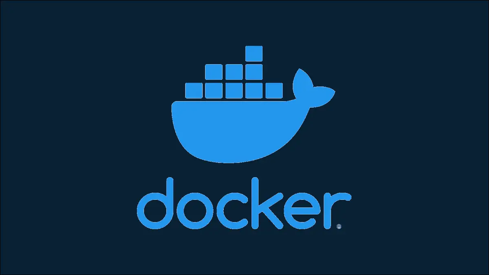

# Docker

## What is Docker
Docker is a standalone software that can be installed on any computer to run containerized applications
When we talk about Docker, its mostly we talk about Docker Engine.

**Docker today is split between:**

1. **Docker Engine** - the open-source container runtime (successor to the old "Community Edition" naming)
2. **Docker subscription plans** (Personal/Pro/Team/Business) - add Docker Desktop, Docker Hub features, and support on top of the open-source engine

!!! note "About 'Enterprise Edition'"
    Older material sometimes refers to "Docker Enterprise Edition (EE)" - that product line was sold to Mirantis in November 2019 and no longer exists as a Docker offering (it lives on as Mirantis Kubernetes Engine). If you see EE/CE terminology in an older resource, treat it as historical, not current.

Docker has an open-source project called "Moby"  to enable and accelerate software containerization.It's source code is available at [github](https://github.com/moby/moby "moby project")

## History of Docker Company
- It's based out of San Francisco
- Started as dotCloud, a PaaS company co-founded by Solomon Hykes in Paris
- dotCloud leveraged Linux Containers (LXC) internally to run customer workloads
- Solomon Hykes built an internal tool to manage those containers and named it Docker
- dotCloud was rebranded as Docker, Inc. in 2013 once the tool was open-sourced

## Docker Images vs Containers
Docker images are read-only templates used to build containers. Containers are deployed instances created from those templates. Images and containers are closely related, and are essential in powering the Docker software platform.

## Docker Use Cases
1. Dev/Prod Parity: When you want the code, environment, software version(s) everything same at both dev and prod
2. Avoid Configuration headache
3. Code Pipeline Management
4. Developer's Productivity
5. App Isolation: contain the blast radius between co-located microservices (note: this is process/resource isolation, not a security boundary by default - see [Docker Security](docker-security.md))
6. Server Consolidation
7. Debugging Capabilities
8. Ease for multi-tenancy approach

## Benefits of using Docker

Before going to the next chapter, please make sure you have install all the necessary software to run Docker on your local machine.
**Install** [Docker from here](https://docs.docker.com/get-docker/ "Download Docker")

**Reference**: [Docker Deep Dive from acloud.guru](https://acloudguru.com/course/docker-deep-dive "Docker Deep Dive from Acloud.guru")

