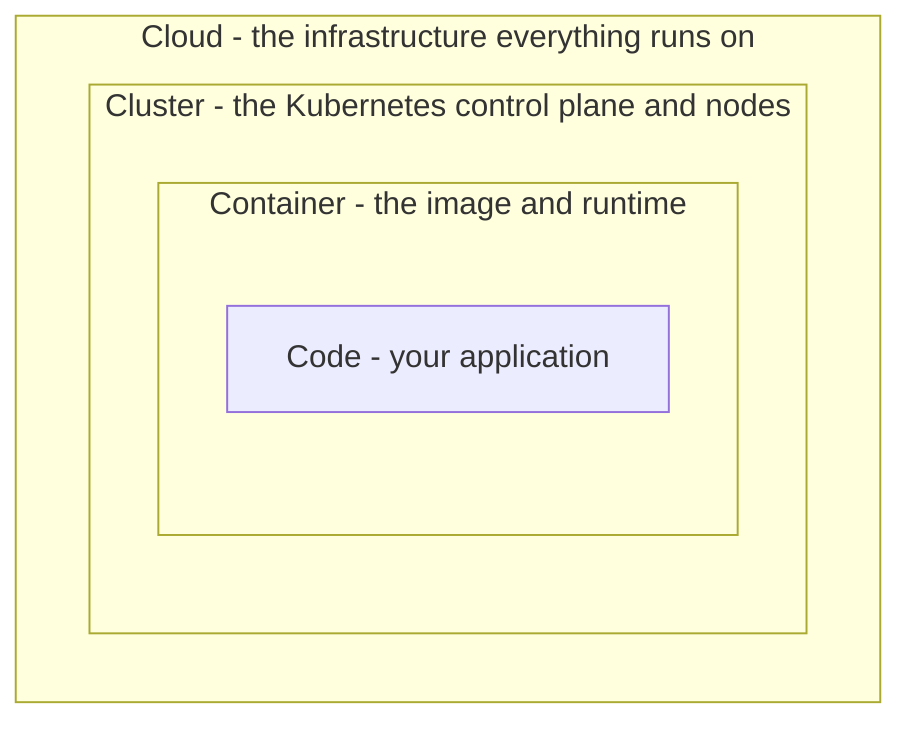
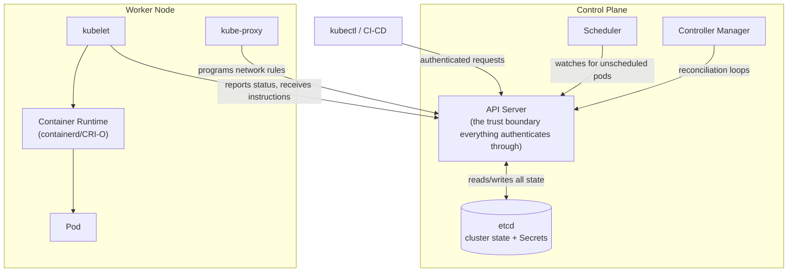
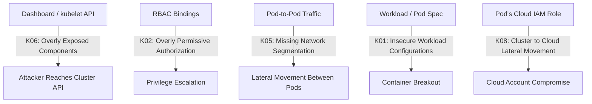

# Kubernetes Architecture & Security

This page is written for **security architects** - the goal isn't another hardening checklist ([Kubernetes Security](kubernetes-security.md) already covers RBAC, NetworkPolicy, Pod Security, Secrets, and API server hardening in depth). This page is the *architecture lens*: what are the components, where do trust boundaries actually sit, and how do the layers fit together.

## 1. The 4Cs of Cloud Native Security

Kubernetes' own documentation frames security as four nested layers, and a control at one layer cannot compensate for a gap at another - a hardened Pod spec doesn't help if the underlying Cloud IAM is wide open, and a locked-down Cluster doesn't help if the Code itself has a SQL injection bug.

| Layer | What It Covers | Who Usually Owns It |
|-------|------------------|------------------------|
| **Cloud** | IAM, VPC/network design, managed K8s service configuration (EKS/GKE/AKS control-plane settings), host OS patching | Cloud/platform team |
| **Cluster** | RBAC, admission control, NetworkPolicy, API server/etcd hardening | Platform/SRE team |
| **Container** | Image provenance, scanning, minimal base images, non-root execution | Application/DevOps team |
| **Code** | Application-level vulnerabilities (injection, auth, etc.) | Application developers |

An architecture review that only checks the Container and Code layers (a scanned image, a non-root Dockerfile) but never verifies Cloud IAM scoping or Cluster RBAC has covered half the model.

## 2. Control-Plane and Node Architecture

The API server is the single trust boundary everything else authenticates through - no component talks to etcd, the scheduler, or another node directly without going through it (or, in the case of the kubelet, exposing its own API that must be independently secured - see Section 4 below and [OWASP Kubernetes Top 10](owasp-kubernetes-top10.md) K06). etcd is the highest-value target on the whole cluster: it holds every Secret, every ConfigMap, and the complete desired-state of the system - which is exactly why [Kubernetes Security](kubernetes-security.md#api-server-and-etcd-hardening) treats etcd encryption and network isolation as non-negotiable.

## 3. Attack-Surface Map

Click any node to jump to the relevant hardening guidance or deep-dive.

## 4. Namespace Isolation Is Logical, Not a Hard Security Boundary

Namespaces partition a cluster for organization and RBAC/NetworkPolicy scoping, but by default every pod in every namespace still shares the same underlying **kernel** on a given node (all containers on a node are just isolated processes via namespaces/cgroups, not separate kernels). That means:

- A kernel-level container escape in one pod can potentially affect other pods on the *same node*, regardless of namespace.
- Namespace boundaries alone are **not sufficient** for hard multi-tenancy (e.g. running untrusted third-party workloads alongside your own).

For genuine hard isolation, use a sandboxed runtime instead of relying on namespaces alone:

| Approach | Isolation Level | Trade-off |
|----------|-------------------|-----------|
| Standard runtime (containerd/runc) + Kubernetes namespaces | Process-level (shared kernel) | Fast, low overhead - fine for trusted, co-owned workloads |
| [gVisor](https://gvisor.dev/) | User-space kernel intercepts syscalls | Extra CPU/latency overhead, strong isolation without full VM cost |
| [Kata Containers](https://katacontainers.io/) | Each pod runs in a lightweight VM | Near-VM isolation, higher overhead than gVisor |

Choose sandboxed runtimes specifically for multi-tenant clusters running workloads you don't fully trust - not as a default for every workload.

## 5. Service Mesh Security - The Layer Above NetworkPolicy

[Kubernetes Security's NetworkPolicy section](kubernetes-security.md#network-policies-default-deny--allow-list) covers L3/L4 (IP/port) traffic control. A service mesh (Istio, Linkerd) adds what NetworkPolicy can't do on its own:

- **Automatic mutual TLS (mTLS)** between every pod-to-pod connection, without changing application code
- **L7-aware authorization** - "service A can call `POST /orders` on service B, but not `DELETE /orders/*`" - NetworkPolicy only sees IP/port, not HTTP methods or paths
- **Traffic observability** - every service-to-service call is loggable/traceable, which directly supports the logging/monitoring gap covered in [OWASP Kubernetes Top 10 K10](owasp-kubernetes-top10.md)

Treat NetworkPolicy as the mandatory baseline (default-deny, explicit allow) and a service mesh as an additional layer for encryption-in-transit and fine-grained authorization - not a replacement for NetworkPolicy.

## Credits/References

1. [Kubernetes Security Overview - the 4Cs](https://kubernetes.io/docs/concepts/security/overview/)
2. [Kubernetes Cluster Architecture](https://kubernetes.io/docs/concepts/architecture/)
3. [gVisor](https://gvisor.dev/)
4. [Kata Containers](https://katacontainers.io/)
5. [Istio Security](https://istio.io/latest/docs/concepts/security/)

## Continue Learning

- [Kubernetes](kubernetes.md) - core concepts if pods/Deployments/control-plane aren't familiar yet
- [Kubernetes Security](kubernetes-security.md) - RBAC, NetworkPolicy, Pod Security, Secrets hardening
- [OWASP Kubernetes Top 10](owasp-kubernetes-top10.md) - the risk categories this page's attack-surface map links to
