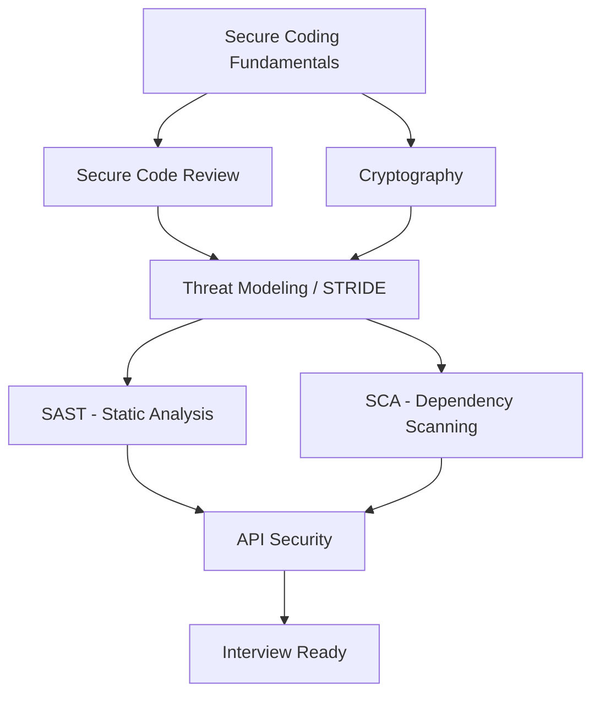

# Security Roadmaps

Visual, **clickable** learning paths for various cybersecurity domains. Click any node below to jump straight to that topic's guide on this site.

## How to Use Roadmaps

1. **Identify your goal** - Choose the security domain you want to master
2. **Follow the path** - Progress through topics in the recommended order
3. **Click to learn** - Each node links directly to the relevant guide
4. **Practice** - Pair each stage with hands-on labs and the interview-question sets linked at the bottom of each domain

---

## Application Security Roadmap

Complete path from beginner to job-ready AppSec engineer. Click any box to open that topic.



**Topics Covered:**

- [Secure Coding](../product-security/application-security/secure-coding.md) - injection, auth, XSS, access control fundamentals
- [Secure Code Review](../product-security/application-security/secure-code-review.md) - manual review methodology and checklists
- [Cryptography](../product-security/application-security/cryptography.md) - encryption, hashing, key management, TLS
- [Threat Modeling](../product-security/application-security/threat-modeling.md) - STRIDE, DFDs, trust boundaries
- [SAST](../product-security/application-security/sast.md) - static analysis tooling and CI/CD gating
- [SCA](../product-security/application-security/sca.md) - dependency/CVE scanning and SBOMs
- [API Security](../product-security/application-security/api-security.md) - OWASP API Top 10

**Practice next:** [jassics/security-interview-questions](https://github.com/jassics/security-interview-questions) for domain-wise Q&A, and [jassics/security-study-plan](https://github.com/jassics/security-study-plan) for a structured study schedule.

## Cloud Security Roadmap

*Coming soon* - AWS, GCP, Azure security learning paths

## DevSecOps Roadmap

*Coming soon* - CI/CD security and automation skills

## Penetration Testing Roadmap

*Coming soon* - Web, network, and mobile pentesting paths

## Security Architecture Roadmap

*Coming soon* - Enterprise security design and implementation

## GRC Roadmap

*Coming soon* - Governance, Risk, and Compliance career path

---

!!! info "Adding New Roadmaps"
    To add a new roadmap, follow the pattern used above for Application Security:

    1. Sketch the learning path as a Mermaid `flowchart TD` (see the AppSec roadmap source for syntax)
    2. Add a `click NodeId "relative/path/"` line per node, pointing at the matching docs page
    3. List the topics covered underneath, with links, plus a "Practice next" line pointing at the relevant [jassics repo](index.md#related-repositories)
    4. Submit a Pull Request

## Roadmap Template

```markdown
## [Domain] Roadmap

\`\`\`mermaid
flowchart TD
    A[Topic 1] --> B[Topic 2] --> C[Topic 3]
    click A "../../path/to/topic-1/" "Topic 1"
    click B "../../path/to/topic-2/" "Topic 2"
    click C "../../path/to/topic-3/" "Topic 3"
\`\`\`

**Topics Covered:**

- [Topic 1](../path/to/topic-1.md)
- [Topic 2](../path/to/topic-2.md)
- [Topic 3](../path/to/topic-3.md)

**Practice next:** [relevant jassics repo](https://github.com/jassics/...)
```
