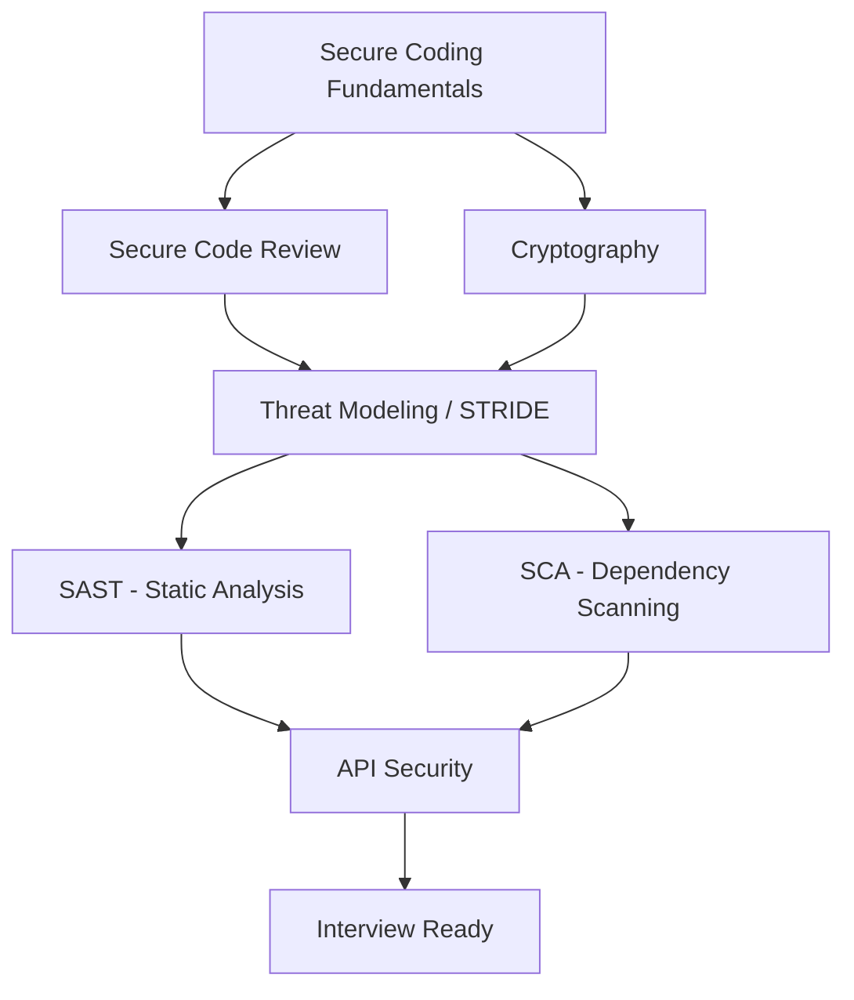

# Security Roadmaps

Visual, **clickable** learning paths for various cybersecurity domains. Click any node below to jump straight to that topic's guide on this site.

!!! tip "The full set of 15 domain roadmaps lives in one repo"
    This page builds out interactive, clickable versions of a subset of roadmaps. For the complete set - Web, API, Network, Software, Cloud, Container/Kubernetes, DevSecOps, Mobile, IoT/ICS-OT, SOC/Blue Team, GRC & Privacy, AI/ML Security, IAM, Cryptography Engineering, and Security Architecture & Leadership - plus career-role mapping, certifications by domain, and real-world job descriptions, see **[jassics/cybersecurity-roadmap](https://github.com/jassics/cybersecurity-roadmap)**. Pair it with [jassics/security-study-plan](https://github.com/jassics/security-study-plan) for the "how to actually study this" companion.

## How to Use Roadmaps

1. **Identify your goal** - Choose the security domain you want to master
2. **Follow the path** - Progress through topics in the recommended order
3. **Click to learn** - Each node links directly to the relevant guide
4. **Practice** - Pair each stage with hands-on labs and the interview-question sets linked at the bottom of each domain

---

## Application Security Roadmap

Complete path from beginner to job-ready AppSec engineer. Click any box to open that topic.


```mermaid
flowchart TD
    A[Secure Coding Fundamentals] --> B[Secure Code Review]
    A --> C[Cryptography]
    B --> D[Threat Modeling / STRIDE]
    C --> D
    D --> E[SAST - Static Analysis]
    D --> F[SCA - Dependency Scanning]
    E --> G[API Security]
    F --> G
    G --> H[Interview Ready]

    click A "../../product-security/application-security/secure-coding/" "Secure Coding"
    click B "../../product-security/application-security/secure-code-review/" "Secure Code Review"
    click C "../../product-security/application-security/cryptography/" "Cryptography"
    click D "../../product-security/application-security/threat-modeling/" "Threat Modeling"
    click E "../../product-security/application-security/sast/" "SAST"
    click F "../../product-security/application-security/sca/" "SCA"
    click G "../../product-security/application-security/api-security/" "API Security"
    click H "https://github.com/jassics/security-interview-questions" "Interview Questions Repo" _blank
```

**Topics Covered:**

- [Secure Coding](../product-security/application-security/secure-coding.md) - injection, auth, XSS, access control fundamentals
- [Secure Code Review](../product-security/application-security/secure-code-review.md) - manual review methodology and checklists
- [Cryptography](../product-security/application-security/cryptography.md) - encryption, hashing, key management, TLS
- [Threat Modeling](../product-security/application-security/threat-modeling.md) - STRIDE, DFDs, trust boundaries
- [SAST](../product-security/application-security/sast.md) - static analysis tooling and CI/CD gating
- [SCA](../product-security/application-security/sca.md) - dependency/CVE scanning and SBOMs
- [API Security](../product-security/application-security/api-security.md) - OWASP API Top 10

**Practice next:** [jassics/security-interview-questions](https://github.com/jassics/security-interview-questions) for domain-wise Q&A, and [jassics/security-study-plan](https://github.com/jassics/security-study-plan) for a structured study schedule.

## Cloud Security Roadmap

Full roadmap: [jassics/cybersecurity-roadmap - Cloud Security](https://github.com/jassics/cybersecurity-roadmap). On this site: [Cloud Security Essentials](../product-security/cloud-security/cloud-security-essentials.md), [AWS](../product-security/cloud-security/learning-aws-security/aws-security-overview.md), [GCP](../product-security/cloud-security/learning-gcp-security/gcp-security-overview.md), [Azure](../product-security/cloud-security/learning-azure-security/azure-security-overview.md).

## DevSecOps Roadmap

Full roadmap: [jassics/cybersecurity-roadmap - DevSecOps](https://github.com/jassics/cybersecurity-roadmap). On this site: [DevSecOps Fundamentals](../product-security/devsecops/devsecops-fundamentals.md).

## Penetration Testing Roadmap

Full roadmap: [jassics/cybersecurity-roadmap - Web/API/Network/Mobile](https://github.com/jassics/cybersecurity-roadmap). On this site: [AppSec Red Teaming & Labs](../product-security/application-security/appsec-red-teaming-labs.md), [Network Security Red Teaming & Labs](../product-security/network-security/network-red-teaming-labs.md), [Cloud Red Teaming & Labs](../product-security/cloud-security/cloud-red-teaming-labs.md).

## Security Architecture Roadmap

Full roadmap: [jassics/cybersecurity-roadmap - Security Architecture & Leadership](https://github.com/jassics/cybersecurity-roadmap). On this site: [Secure Application Architecture](../product-security/application-security/secure-application-architecture.md), [AI/LLM Security Architecture](../ai-security/ai-llm-security-architecture.md).

## GRC Roadmap

Full roadmap: [jassics/cybersecurity-roadmap - GRC & Privacy](https://github.com/jassics/cybersecurity-roadmap). On this site: [GRC Overview](../grc/grc-overview.md).

## AI/ML Security Roadmap

Full roadmap: [jassics/cybersecurity-roadmap - AI/ML Security](https://github.com/jassics/cybersecurity-roadmap). On this site: [AI Fundamentals Overview](../ai-fundamentals/index.md) and [AI Security Overview](../ai-security/ai-security-overview.md).

---

!!! info "Adding New Roadmaps"
    To add a new roadmap, follow the pattern used above for Application Security:

    1. Sketch the learning path as a Mermaid `flowchart TD` (see the AppSec roadmap source for syntax)
    2. Add a `click NodeId "relative/path/"` line per node, pointing at the matching docs page
    3. List the topics covered underneath, with links, plus a "Practice next" line pointing at the relevant [jassics repo](index.md#related-repositories)
    4. Submit a Pull Request

## Roadmap Template

```markdown
## [Domain] Roadmap

\`\`\`mermaid
flowchart TD
    A[Topic 1] --> B[Topic 2] --> C[Topic 3]
    click A "../../path/to/topic-1/" "Topic 1"
    click B "../../path/to/topic-2/" "Topic 2"
    click C "../../path/to/topic-3/" "Topic 3"
\`\`\`

**Topics Covered:**

- [Topic 1](../path/to/topic-1.md)
- [Topic 2](../path/to/topic-2.md)
- [Topic 3](../path/to/topic-3.md)

**Practice next:** [relevant jassics repo](https://github.com/jassics/...)
```
